# IoTHunter 架构设计文档

> 文档版本：v2.0  
> 项目名称：IoTHunter  
> 系统定位：Capability-Isolated Multi-Agent IoT Vulnerability Research Harness  
> 目标读者：架构师、后端工程师、Agent 工程师、安全研究员、AI Coding Agent  
> 文档用途：作为 IoTHunter 的总体架构、核心领域模型、工程边界与开发实施依据

---

# 1. 项目概述

IoTHunter 是一个面向 IoT 安全研究场景的多 Agent 漏洞挖掘 Harness。

系统通过 Commander 控制平面调度多个安全专家 Agent，并以 Capability 作为能力隔离边界，以 Tool Runtime 作为安全执行底座，围绕统一的 Finding / Evidence Store 持续积累漏洞线索、分析结果、验证证据和知识资产。

IoTHunter 不把 Agent 直接等同于执行器，而明确区分：

```text
Agent ≠ Capability ≠ Tool
```

其中：

```text
Agent       = 思考、决策、选择能力、评估结果
Capability  = 稳定、可测试、可复用的专业能力
Tool        = 实际执行底层命令、脚本、容器、设备操作
```

核心运行闭环：

```text
Target
  ↓
Commander
  ↓
Task
  ↓
Agent
  ↓
Capability
  ↓
Tool Runtime
  ↓
Evidence
  ↓
Finding
  ↓
Commander Decision
  ↓
Report / Knowledge / Skill
```

IoTHunter 的核心架构目标是：

> 模型可替换、Agent 可扩展、Capability 可组合、Tool 可插拔、执行可隔离、Finding 可追溯、任务可恢复、权限可控制、知识可复用。

---

# 2. 设计原则

## 2.1 Finding-Centric

Finding 是 IoTHunter 的第一核心领域对象。

Agent、Capability、Tool 都围绕 Finding 产生和消费证据。

一个潜在漏洞通常从：

```text
Hypothesis
```

逐渐演化为：

```text
Candidate
→ Analyzing
→ ReadyForValidation
→ Validating
→ Validated
→ Reportable
→ Reported
→ KnowledgeCaptured
```

任何关键结论都必须能够追溯到 Evidence。

---

## 2.2 Capability Isolation

Capability 是 IoTHunter 的能力边界。

Agent 不直接调用任意系统命令，不直接操作设备，不直接执行高风险行为。

Agent 只能请求 Capability：

```json
{
  "capability": "firmware.extract",
  "target": "artifact://firmware/xxx",
  "objective": "extract filesystem"
}
```

Capability 再通过 Tool Gateway 选择具体实现：

```text
firmware.extract
    ↓
Firmware Capability
    ↓
Tool Gateway
    ↓
binwalk / unblob / custom extractor
```

---

## 2.3 Control Plane / Execution Plane Separation

Go 负责 IoTHunter 核心与调度控制。

Python 负责安全分析与专业能力实现。

推荐边界：

```text
Go
├── API Backend
├── Commander
├── Scheduler
├── Task Engine
├── Event Bus
├── Agent Lifecycle
├── Permission
├── Approval
├── Capability Registry
├── Tool Gateway
├── Device Manager
├── Audit
└── Worker Orchestration

Python
├── Firmware Capability
├── Binary Capability
├── Taint Capability
├── Protocol Capability
├── Fuzz Capability
├── Emulation Capability
├── AI Security Analysis
├── Knowledge Processing
└── Security Scripts
```

---

## 2.4 Structured Collaboration

Agent 之间不直接依赖长文本上下文。

统一通过结构化对象协作：

```text
Workspace
Target
Task
Agent
Capability
Tool
Finding
Evidence
Artifact
Skill
Event
Approval
```

---

## 2.5 Least Privilege

系统所有能力默认最小权限。

权限路径：

```text
Agent
  ↓
Capability
  ↓
Tool
  ↓
Resource
```

每一层都必须检查权限。

---

# 3. 总体架构

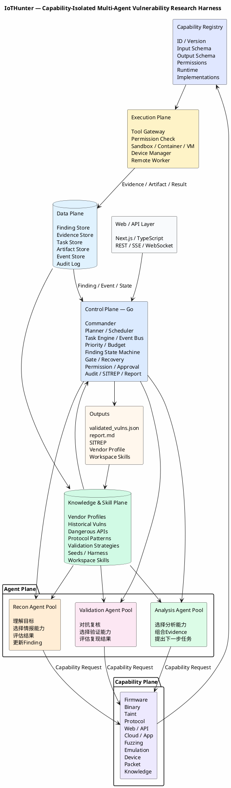

---

# 4. 系统分层

IoTHunter v2 建议划分为七个逻辑平面。

```text
┌──────────────────────────────────────┐
│              Web / API              │
├──────────────────────────────────────┤
│            Control Plane            │
├──────────────────────────────────────┤
│             Agent Plane             │
├──────────────────────────────────────┤
│          Capability Plane           │
├──────────────────────────────────────┤
│           Execution Plane           │
├──────────────────────────────────────┤
│              Data Plane             │
├──────────────────────────────────────┤
│       Knowledge & Skill Plane       │
└──────────────────────────────────────┘
```

---

# 5. Web / API Layer

推荐技术：

```text
TypeScript
React / Next.js
REST API
SSE / WebSocket
```

主要能力：

```text
Workspace
Target
Agent Run
Task
Finding
Evidence
Artifact
Approval
Model Config
Capability Config
Tool Config
SITREP
Report
Audit
```

UI 不直接访问 Agent 或 Tool。

所有动作统一通过 Control Plane。

---

# 6. Control Plane

Control Plane 是 IoTHunter 的大脑。

推荐使用 Go 实现。

## 6.1 主要组件

```text
Commander
Planner
Scheduler
Task Engine
Event Bus
Finding State Machine
Priority Engine
Budget Manager
Gate Engine
Recovery Manager
Permission Engine
Approval Manager
Capability Registry
Tool Gateway
Device Manager
Audit Service
SITREP Engine
Report Engine
Knowledge Curator
```

---

# 7. Commander

Commander 贯穿整个漏洞研究生命周期，不属于某一个阶段。

职责：

```text
理解 Target
分析当前 Finding
制定研究计划
拆解 Task
选择 Agent
选择优先级
选择是否继续投入
执行质量门控
控制预算
处理失败与回退
请求人工授权
生成 SITREP
生成报告
触发知识沉淀
```

Commander 不绑定具体模型。

```yaml
agent:
  role: commander

model:
  provider: user_defined
  name: user_defined
```

---

# 8. Commander 内部架构

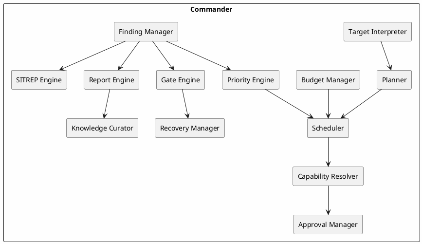

---

# 9. Agent Plane

Agent 是轻量化的智能决策单元。

Agent 主要负责四件事：

```text
Understand
Reason
Select Capability
Evaluate Result
```

Agent 不应：

```text
直接运行任意 shell
直接操作数据库
直接修改 Finding State
直接访问真实设备
直接执行高风险操作
```

---

# 10. Agent 类型

基础类型：

```text
commander
recon
analysis
validation
utility
```

专业 Agent 可以按需扩展：

```text
firmware
binary
web
android
cloud
nfc
ble
matter
baseband
hardware
```

专业 Agent 仍然通过 Capability 工作，不直接绑定具体 Tool。

---

# 11. Recon Agent Pool

Recon 负责提升高价值 Finding 的先验概率。

主要研究方向：

```text
Patch Intelligence
CVE / Advisory
Threat Intelligence
Historical Vulnerability
Similarity Inference
Attack Surface Discovery
Vendor Fingerprint
Component Fingerprint
```

典型输出：

```text
Hypothesis
Candidate Finding
Attack Surface
Candidate Component
Candidate Function
Priority Hint
Evidence
Recommended Task
```

---

# 12. Analysis Agent Pool

Analysis 负责将线索转化为具体漏洞路径和约束。

重点能力：

```text
Firmware Analysis
Binary Analysis
Taint Analysis
Protocol Analysis
Hidden Interface Reconstruction
Config Analysis
Cloud / App Correlation
Vendor-specific Analysis
```

Analysis 不要求自己实现这些能力。

它只负责选择 Capability，并解释 Capability 结果。

---

# 13. Validation Agent Pool

Validation 默认站在“误报复核”的立场。

主要职责：

```text
确认 Source 是否可控
确认路径是否可达
寻找遗漏约束
检查权限前提
评估漏洞机制
选择验证方式
评估动态结果
生成安全 PoC
分配 CWE
计算 CVSS
评估影响
```

Validation 通过 Capability 调用：

```text
fuzz.constraint
emulation.run
device.validate
packet.generate
poc.verify
cvss.score
```

---

# 14. Capability Plane

Capability 是 IoTHunter 的核心能力边界。

每一个 Capability 都必须定义：

```text
ID
Version
Input Schema
Output Schema
Permission
Runtime Requirement
Resource Requirement
Implementation
Timeout
Audit Policy
```

---

# 15. Capability Definition

示例：

```yaml
id: taint.trace
version: 1.2

category: analysis

description: trace tainted input to dangerous sink

input_schema:
  artifact: uri
  source: object
  sink: object

output_schema:
  taint_paths: array
  evidence: array
  confidence: number

permissions:
  network: false
  filesystem: readonly
  device: false
  destructive: false

runtime:
  isolation: container
  cpu: 4
  memory: 8G
  timeout: 1800

implementations:
  - angr
  - ghidra
  - custom
```

---

# 16. Capability Registry

Capability Registry 用于统一发现和解析能力。

推荐初始 Capability：

```text
firmware.extract
firmware.inventory
firmware.config_scan

binary.identify
binary.decompile
binary.callgraph
binary.xref
binary.search_string

taint.trace
taint.storage_trace

protocol.parse
protocol.attack_surface
protocol.hidden_interface

web.route_discovery
web.auth_analysis

config.audit

fuzz.constraint
fuzz.seed_generate

emulation.run

packet.generate
packet.replay

device.inspect
device.validate

poc.verify
cvss.score

knowledge.search
knowledge.pattern_match
```

---

# 17. Capability 选择流程

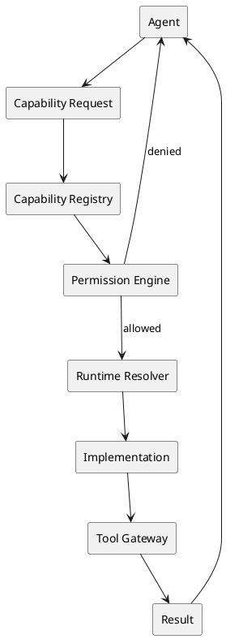

---

# 18. Capability 与 Skill 的区别

必须严格区分：

```text
Capability = 原子能力
Skill      = 多个 Capability 组合形成的方法论或工作流
```

示例：

```text
Capability:
  binary.search_string
  binary.xref
  taint.trace
```

Skill：

```text
hidden_web_api_discovery

1. firmware.extract
2. web.route_discovery
3. binary.search_string
4. binary.xref
5. protocol.hidden_interface
6. taint.trace
```

因此：

> Capability 类似 API，Skill 类似 Workflow。

---

# 19. Skill Definition

```yaml
name: hidden_web_api_discovery
version: 1.0

roles:
  - recon
  - analysis

steps:
  - capability: firmware.extract
  - capability: web.route_discovery
  - capability: binary.search_string
  - capability: binary.xref
  - capability: protocol.hidden_interface
  - capability: taint.trace

outputs:
  - finding
  - evidence

permissions:
  destructive: false
```

---

# 20. Execution Plane

Execution Plane 负责实际运行能力。

组件：

```text
Tool Gateway
Permission Check
Sandbox Manager
Container Runner
VM Runner
Remote Worker
Device Manager
Resource Controller
Artifact Collector
```

Execution Plane 不进行业务决策。

---

# 21. Tool Gateway

Agent 和 Capability 都不应直接运行 Tool。

统一调用：

```text
Tool Gateway
```

流程：

```text
Capability
   ↓
Tool Gateway
   ↓
Permission Check
   ↓
Runtime Selection
   ↓
Sandbox / Device / Remote Worker
   ↓
Tool
   ↓
Artifact / Evidence
```

---

# 22. Tool Definition

```yaml
name: binwalk

category: firmware

execution:
  type: container

permissions:
  network: false
  filesystem: workspace
  device: false
  destructive: false

resources:
  cpu: 2
  memory: 4G

timeout: 600

command:
  - binwalk
  - -e
  - "{{artifact_path}}"
```

---

# 23. Tool 类型

推荐：

```text
filesystem
shell
python
git
web
binary_analysis
decompiler
firmware_extract
protocol_parser
fuzzer
emulator
packet
device
custom
```

---

# 24. Sandbox

默认 Tool 必须运行在隔离环境。

推荐：

```text
MVP:
Docker / Podman

Production:
Container + Remote Worker
Optional Firecracker / KVM
```

限制：

```text
CPU
Memory
Disk
Runtime
Network
Filesystem
Linux Capability
Device
```

---

# 25. Capability Worker 模型

Capability 不需要全部常驻。

推荐：

```text
Light Capability
    ↓
Long-running Worker

Heavy Capability
    ↓
Ephemeral Container
```

常驻：

```text
Knowledge Search
CVE Search
Config Parser
Metadata Analysis
```

临时容器：

```text
Firmware Extraction
Ghidra
Large Binary Analysis
QEMU
Fuzzing
Heavy Taint Analysis
```

---

# 26. Device Manager

真实设备必须视为特殊资源。

Device Schema：

```json
{
  "device_id": "",
  "vendor": "",
  "model": "",
  "serial": "",
  "transport": "",
  "status": "available",
  "authorization": true,
  "owner": "",
  "lock_owner": null
}
```

真实设备调用要求：

```text
Target authorized
AND
Task permits device
AND
Capability permits device
AND
Tool permits device
AND
Device available
```

---

# 27. Human Approval

高风险动作必须支持人工确认。

建议强制审批：

```text
真实设备 fuzzing
设备重启
写 Flash
修改关键配置
发送潜在破坏性协议包
压力型测试
可能持久化影响的 PoC
```

---

# 28. Approval 流程

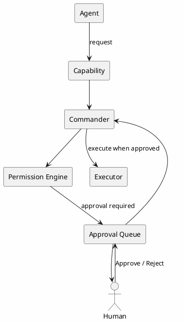

---

# 29. Data Plane

Data Plane 保存系统事实。

组成：

```text
Finding Store
Evidence Store
Task Store
Artifact Store
Event Store
Audit Log
Agent Run Store
Approval Store
```

推荐：

```text
PostgreSQL
+
Object Storage
+
Optional Vector DB
```

---

# 30. Finding Schema

```json
{
  "finding_id": "F-2026-000001",
  "workspace_id": "W-001",
  "target_id": "T-001",

  "title": "",

  "state": "candidate",
  "priority": "P1",
  "confidence": 0.72,

  "attack_surface": {
    "type": "",
    "protocol": "",
    "entrypoint": ""
  },

  "location": {
    "component": "",
    "binary": "",
    "file": "",
    "function": "",
    "offset": ""
  },

  "source": [],
  "sink": [],
  "call_chain": [],
  "taint_path": [],
  "constraints": [],

  "cwe": [],

  "evidence_ids": [],
  "artifact_ids": [],

  "validation": {
    "state": "not_started",
    "method": null,
    "reproducible": false,
    "result": null
  },

  "poc": null,
  "cvss": null,
  "impact": null,

  "assigned_agents": [],

  "created_at": "",
  "updated_at": ""
}
```

---

# 31. Evidence Schema

```json
{
  "evidence_id": "E-000001",

  "finding_id": "F-2026-000001",

  "type": "taint_path",

  "source": {
    "agent_id": "analysis-01",
    "task_id": "TASK-01",
    "capability_id": "taint.trace",
    "tool_run_id": "TOOLRUN-01"
  },

  "confidence": 0.93,

  "content": {},

  "artifact_refs": [],

  "created_at": ""
}
```

Evidence 类型：

```text
patch_diff
vendor_advisory
cve
function
source
sink
call_chain
taint_path
constraint
protocol_field
config
binary_offset
packet
crash
stack_trace
log
screenshot
poc
dynamic_result
manual_review
```

---

# 32. Artifact Store

大型结果统一放 Artifact Store。

保存：

```text
Firmware
Extracted Filesystem
Binary
Decompiler Output
Packet Capture
Crash Dump
Screenshot
PoC
Harness
Seed Corpus
Report
Logs
```

数据库只保存：

```text
artifact_id
sha256
path
type
metadata
```

---

# 33. Finding 生命周期

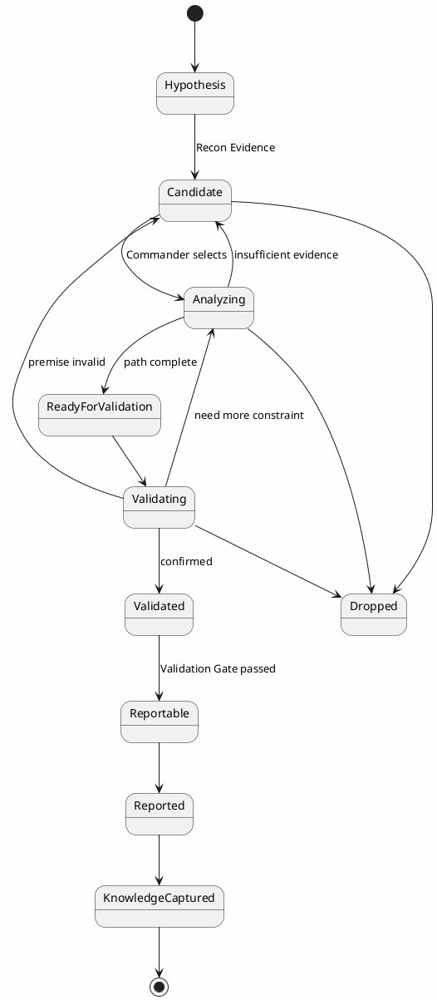

---

# 34. Task Model

所有 Agent 工作都通过 Task 驱动。

```json
{
  "task_id": "TASK-001",

  "workspace_id": "W-001",
  "finding_id": "F-001",

  "type": "analysis.taint",

  "objective": "确认外部输入是否到达危险调用",

  "priority": "P0",

  "status": "queued",

  "assigned_agent": null,

  "required_capabilities": [
    "taint.trace"
  ],

  "context": {
    "evidence_ids": [],
    "artifact_ids": []
  },

  "budget": {
    "max_tokens": 30000,
    "max_runtime_seconds": 1800,
    "max_tool_calls": 100
  },

  "permissions": {
    "network": false,
    "device": false,
    "destructive": false
  }
}
```

---

# 35. Task 生命周期

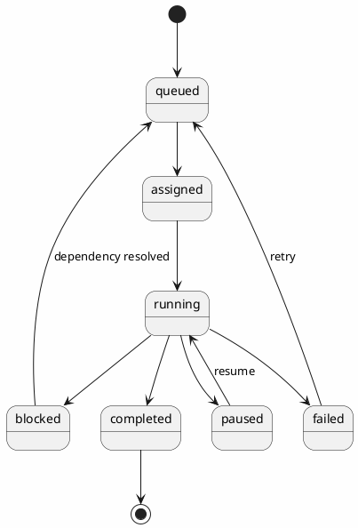

---

# 36. Event Bus

系统内部推荐事件驱动。

主要事件：

```text
workspace.created
target.created
target.indexed

task.created
task.started
task.completed
task.failed
task.blocked

finding.created
finding.updated
finding.promoted
finding.dropped

evidence.added

capability.started
capability.completed
capability.failed

tool.started
tool.completed
tool.failed

validation.started
validation.completed

gate.passed
gate.failed

report.generated

knowledge.updated

human.approval.required
human.approval.granted
human.approval.denied
```

---

# 37. Scheduler

Scheduler 不直接理解安全逻辑。

它根据：

```text
Priority
Agent Capacity
Capability Availability
Dependency
Budget
Permission
Resource Requirement
Device Availability
Target Lock
```

进行调度。

MVP：

```text
Priority Queue + Worker Pool
```

Production：

```text
Capability-aware Scheduling
Cost-aware Scheduling
Model Routing
Remote Worker Scheduling
```

---

# 38. 动态并发

禁止硬编码固定 Agent 并发。

推荐：

```yaml
agent_pool:
  global_max_workers: 8

  recon:
    min: 0
    max: 4

  analysis:
    min: 0
    max: 6

  validation:
    min: 0
    max: 4
```

Capability Worker 独立配置：

```yaml
capability_pool:
  firmware.extract:
    max: 2

  binary.decompile:
    max: 2

  taint.trace:
    max: 4

  fuzz.constraint:
    max: 2

  emulation.run:
    max: 1
```

---

# 39. Finding Priority

推荐：

```text
Score =
Impact
× Reachability
× Confidence
× Exploitability
× IntelligenceQuality
÷ ValidationCost
```

内部可统一归一化到：

```text
0 ~ 100
```

Commander 优先推进：

```text
高影响
+
高可达
+
多证据收敛
+
低验证成本
```

的 Finding。

---

# 40. Quality Gate

v2 仍保留两个核心 Gate。

## 40.1 Finding Gate

判断 Finding 是否值得继续投入。

规则示例：

```text
存在具体攻击面

AND

至少一个有效 Evidence

AND

存在明确组件 / 函数 / 协议对象

AND

Confidence >= threshold

AND

Priority >= threshold
```

输出：

```text
PASS
HOLD
DROP
NEED_MORE_INTEL
```

---

## 40.2 Validation Gate

判断是否达到报告标准。

建议：

```text
Mechanism Complete
Reachability Confirmed
CWE Assigned
Reproducible
Evidence Complete
Impact Defined
PoC Safe
CVSS Ready
```

输出：

```text
REPORTABLE
NEED_MORE_ANALYSIS
NEED_MORE_VALIDATION
REJECTED
```

---

# 41. Gate 回退

```plantuml
@startuml Gate_Fallback_v2

skinparam backgroundColor #FEFEFE
skinparam defaultFontName "Microsoft YaHei"

rectangle Candidate
diamond "Finding Gate" as FG
rectangle Analysis
rectangle Validation
diamond "Validation Gate" as VG
rectangle Report
rectangle Hold

Candidate --> FG

FG --> Analysis : PASS
FG --> Hold : HOLD / DROP

Analysis --> Validation

Validation --> VG

VG --> Report : REPORTABLE
VG --> Analysis : NEED_MORE_ANALYSIS
VG --> Validation : NEED_MORE_VALIDATION
VG --> Candidate : premise unclear

@enduml
```

---

# 42. Knowledge & Skill Plane

知识层主要保存：

```text
Vendor Profile
Historical Vulnerability
Dangerous API
Protocol Pattern
Taint Pattern
Validation Strategy
Fuzz Seed
Harness
Workspace Skill
```

知识只能作为辅助推理来源。

不得直接作为漏洞事实。

---

# 43. Vendor Profile

```json
{
  "vendor": "",

  "components": [],
  "services": [],
  "protocols": [],
  "config_system": [],
  "dangerous_apis": [],
  "historical_vulns": [],
  "auth_patterns": [],
  "known_paths": [],
  "skills": []
}
```

---

# 44. Vulnerability Pattern

```json
{
  "pattern_id": "",
  "category": "stored_taint",

  "source_type": "http",
  "storage": "nvram",
  "sink": "sprintf",

  "cwe": "CWE-120"
}
```

例如：

```text
HTTP Input
   ↓
config_set()
   ↓
NVRAM
   ↓
reboot
   ↓
config_load()
   ↓
sprintf()
```

---

# 45. Knowledge 回灌

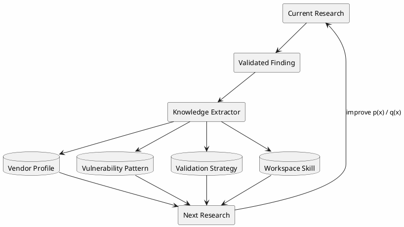

---

# 46. Workspace

每个研究项目对应一个 Workspace。

```text
Workspace
  id
  name
  owner
  targets
  findings
  tasks
  evidence
  artifacts
  approvals
  reports
  knowledge
```

推荐目录：

```text
workspace/

├── manifest.yaml

├── targets/
│   ├── firmware/
│   ├── filesystem/
│   └── metadata/

├── findings/

├── evidence/
│   ├── static/
│   ├── dynamic/
│   ├── packet/
│   └── manual/

├── artifacts/
│   ├── binary/
│   ├── poc/
│   ├── fuzz/
│   ├── core/
│   └── reports/

├── tasks/

├── capabilities/

├── knowledge/

├── skills/

├── approvals/

├── logs/

└── sitrep/
```

---

# 47. Model Registry

所有 Agent 的模型必须可配置。

禁止写死模型名称。

```yaml
models:

  commander:
    provider: openai_compatible
    model: user_defined

  recon:
    provider: user_defined
    model: user_defined

  analysis:
    provider: user_defined
    model: user_defined

  validation:
    provider: user_defined
    model: user_defined
```

统一接口：

```go
type ModelAdapter interface {
    Chat(ctx context.Context, req ChatRequest) (ChatResponse, error)
}
```

可支持：

```text
OpenAI-compatible
Anthropic
Gemini
Local Model
Custom HTTP Endpoint
```

---

# 48. Prompt 管理

Prompt 必须版本化。

```text
prompts/

├── commander/
│   ├── planner_v1.md
│   ├── gate_v1.md
│   └── recovery_v1.md

├── recon/

├── analysis/

└── validation/
```

保存：

```text
prompt_name
prompt_version
sha256
```

---

# 49. Structured Output

所有核心 Agent 输出优先采用结构化 Schema。

例如：

```json
{
  "summary": "",
  "new_findings": [],
  "evidence": [],
  "capability_requests": [],
  "recommended_tasks": [],
  "confidence": 0.0
}
```

禁止使用自然语言文本作为关键状态唯一来源。

---

# 50. Capability Request

统一结构：

```json
{
  "request_id": "",

  "task_id": "",

  "agent_id": "",

  "capability_id": "taint.trace",

  "objective": "",

  "inputs": {},

  "constraints": {},

  "permissions": {},

  "budget": {}
}
```

---

# 51. Capability Result

```json
{
  "request_id": "",

  "capability_id": "taint.trace",

  "status": "completed",

  "summary": "",

  "evidence": [],

  "artifacts": [],

  "confidence": 0.9,

  "metrics": {
    "runtime_ms": 0
  }
}
```

---

# 52. Recon 工作流

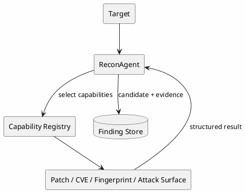

---

# 53. Analysis 工作流

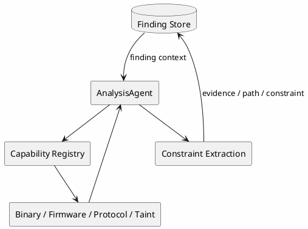

---

# 54. Validation 工作流

```plantuml
@startuml Validation_Workflow_v2

skinparam backgroundColor #FEFEFE
skinparam defaultFontName "Microsoft YaHei"

database "Finding Store" as F
rectangle ValidationAgent
diamond "Plausible?" as P
rectangle "Capability Registry"
rectangle "Fuzz / Emulation / Device / PoC"
rectangle "Validation Evidence"

F --> ValidationAgent

ValidationAgent --> P

P --> F : No / downgrade
P --> "Capability Registry" : Yes

"Capability Registry" --> "Fuzz / Emulation / Device / PoC"

"Fuzz / Emulation / Device / PoC" --> ValidationAgent

ValidationAgent --> "Validation Evidence"

"Validation Evidence" --> F

@enduml
```

---

# 55. 完整运行时序

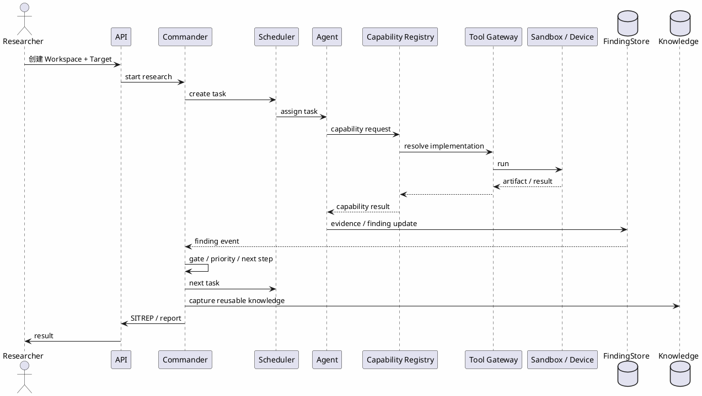

---

# 56. 数据库设计

推荐：

```text
PostgreSQL
+
Object Storage
+
Optional Vector DB
```

建议表：

```text
workspaces
targets
agents
agent_runs
tasks
task_dependencies
capabilities
capability_runs
tools
tool_runs
findings
finding_relations
evidence
artifacts
validations
gate_decisions
approvals
events
knowledge_items
skills
model_configs
tool_configs
audit_logs
```

---

# 57. API 设计

推荐：

```text
Go Backend
REST
SSE / WebSocket
```

Workspace：

```text
POST /api/v1/workspaces
GET  /api/v1/workspaces/{id}
POST /api/v1/workspaces/{id}/run
POST /api/v1/workspaces/{id}/pause
```

Target：

```text
POST /api/v1/workspaces/{id}/targets
GET  /api/v1/targets/{id}
```

Finding：

```text
GET  /api/v1/findings
GET  /api/v1/findings/{id}
POST /api/v1/findings/{id}/promote
POST /api/v1/findings/{id}/drop
```

Task：

```text
GET  /api/v1/tasks
GET  /api/v1/tasks/{id}
POST /api/v1/tasks/{id}/retry
POST /api/v1/tasks/{id}/cancel
```

Capability：

```text
GET /api/v1/capabilities
GET /api/v1/capabilities/{id}
POST /api/v1/capabilities/{id}/test
```

Approval：

```text
GET  /api/v1/approvals
POST /api/v1/approvals/{id}/approve
POST /api/v1/approvals/{id}/reject
```

---

# 58. 内部 RPC / Worker 通信

推荐：

```text
Control Plane ↔ Worker

gRPC / NATS / HTTP internal API
```

MVP 可用 HTTP / JSON。

Production 建议：

```text
gRPC + Event Bus
```

---

# 59. 审计日志

必须记录：

```text
谁
什么时候
创建什么 Task
调用什么 Agent
Agent 使用什么模型
请求什么 Capability
Capability 选择什么 Implementation
调用什么 Tool
Tool 执行什么命令
访问什么 Resource
生成什么 Evidence
修改什么 Finding
谁批准高风险操作
```

Audit Log 必须 append-only。

Agent 无权删除或覆盖。

---

# 60. 可观测性

推荐：

```text
OpenTelemetry
Prometheus
Grafana
Structured Logging
```

指标：

```text
Task Success Rate
Task Runtime
Queue Depth
Agent Utilization
Capability Runtime
Tool Runtime
Model Cost
Finding Conversion
Validation Success
Retry Count
Device Utilization
Approval Wait Time
```

---

# 61. 异常恢复

必须处理：

```text
Model Timeout
Model Provider Error
Invalid Structured Output
Capability Failure
Tool Crash
Tool Timeout
Worker Crash
Container Crash
Network Failure
Device Offline
Artifact Missing
Database Error
Context Overflow
```

---

# 62. Retry Policy

推荐：

```text
Model transient error:
  exponential retry <= 3

Invalid structured output:
  repair once

Capability transient failure:
  retry by policy

Tool timeout:
  retry <= 1

Validation failure:
  no blind retry
  return to Commander

Device failure:
  block task
  require recovery
```

---

# 63. Context Management

Agent 上下文只加载必要信息：

```text
Task Objective
Finding Summary
Relevant Evidence
Relevant Artifact Index
Relevant Knowledge
Relevant Skill
Recent Decisions
Capability Catalog
Permission Context
```

禁止每次注入整个 Workspace。

---

# 64. Retrieval

知识检索：

```text
Metadata Filter
+
Keyword
+
Vector Similarity
```

推荐优先级：

```text
Vendor / Model
Component
Protocol
Function
CWE
Historical Finding
Semantic Similarity
```

检索结果仅作为参考。

---

# 65. 技术栈

## Frontend

```text
TypeScript
React / Next.js
Tailwind CSS
```

## Core Backend

```text
Go
Gin / Echo / Fiber / net/http
sqlc / GORM
OpenTelemetry
```

优先推荐：

```text
Go + net/http / chi
```

保持 IoTHunter 核心简洁。

## Capability Runtime

```text
Python 3.12+
Pydantic
asyncio
```

按能力选择：

```text
angr
pwntools
Ghidra scripting
QEMU
binwalk / unblob
custom scripts
```

## Infrastructure

```text
PostgreSQL
Redis / NATS
MinIO / S3
Docker / Podman
```

---

# 66. 推荐代码目录

```text
iothunter/

├── web/
│   └── nextjs/

├── cmd/
│   ├── api/
│   ├── worker/
│   └── cli/

├── internal/
│   ├── commander/
│   │   ├── planner/
│   │   ├── scheduler/
│   │   ├── priority/
│   │   ├── gate/
│   │   ├── recovery/
│   │   ├── sitrep/
│   │   └── report/
│   │
│   ├── agents/
│   │   ├── registry/
│   │   ├── runtime/
│   │   └── lifecycle/
│   │
│   ├── capabilities/
│   │   ├── registry/
│   │   ├── resolver/
│   │   └── schemas/
│   │
│   ├── tools/
│   │   ├── gateway/
│   │   ├── permission/
│   │   └── runtime/
│   │
│   ├── devices/
│   │
│   ├── findings/
│   │
│   ├── evidence/
│   │
│   ├── tasks/
│   │
│   ├── approvals/
│   │
│   ├── knowledge/
│   │
│   ├── skills/
│   │
│   ├── storage/
│   │
│   ├── events/
│   │
│   ├── audit/
│   │
│   └── observability/
│
├── capability-workers/
│   ├── firmware/
│   ├── binary/
│   ├── taint/
│   ├── protocol/
│   ├── fuzz/
│   ├── emulation/
│   └── knowledge/
│
├── prompts/
│
├── schemas/
│
├── migrations/
│
└── tests/
```

---

# 67. 核心领域对象

IoTHunter v2 建议固定以下 12 个核心对象：

```text
Workspace
Target
Task
Agent
Capability
Tool
Finding
Evidence
Artifact
Skill
Event
Approval
```

其中最核心的是：

```text
Task
Finding
Evidence
Capability
Tool Runtime
Commander
```

---

# 68. AI Coding Agent 开发约束

AI 开发本系统时必须遵循：

1. Finding 是核心事实对象；
2. Evidence 是所有结论的来源；
3. Agent 不直接修改数据库；
4. Agent 不直接调用任意 Tool；
5. Agent 必须通过 Capability 访问专业能力；
6. Capability 必须有明确输入输出 Schema；
7. Capability 必须有权限声明；
8. Capability 必须可以独立测试；
9. Tool 必须通过 Tool Gateway；
10. Tool 必须经过 Permission Check；
11. Tool 默认运行在 Sandbox；
12. 模型不得硬编码；
13. Agent 并发数不得硬编码；
14. Capability 并发数不得硬编码；
15. Finding State 必须由状态机控制；
16. Evidence 不允许静默覆盖；
17. Artifact 必须计算 hash；
18. Prompt 必须版本化；
19. Task 必须可重试、暂停、恢复；
20. 高风险真实设备操作必须支持 Human Approval；
21. 所有执行必须生成 Audit Log；
22. Knowledge Retrieval 结果不得直接当作事实；
23. Validation Agent 默认以误报复核立场工作；
24. Commander 是唯一全局调度决策中心；
25. Scheduler 不承担安全业务判断；
26. Capability 不承担全局研究决策；
27. Tool 不承担业务逻辑；
28. Execution Plane 不直接修改 Finding State；
29. 所有关键结论必须可追溯至 Evidence；
30. 所有权限默认最小化。

---

# 69. MVP 开发计划

## Phase 1：IoTHunter Core

实现：

```text
Workspace
Target
Task
Finding
Evidence
Agent Runtime
Model Adapter
Commander
Scheduler
Event Bus
```

目标：

> 完成 Target → Task → Agent → Finding 的最小闭环。

---

## Phase 2：Capability Isolation

实现：

```text
Capability Registry
Capability Request
Capability Result
Capability Worker
Tool Gateway
Permission Engine
Sandbox
```

目标：

> 完成 Agent → Capability → Tool → Evidence 的安全执行链。

---

## Phase 3：Validation

实现：

```text
Validation Agent
fuzz.constraint
emulation.run
device.validate
Approval
Validation Gate
```

---

## Phase 4：Knowledge & Skill

实现：

```text
Vendor Profile
Vulnerability Pattern
Skill
Knowledge Retrieval
Knowledge Feedback
```

---

## Phase 5：Platform

实现：

```text
Web UI
SITREP
Report
Metrics
Distributed Worker
Dynamic Scheduling
Advanced Device Manager
```

---

# 70. MVP 最小闭环

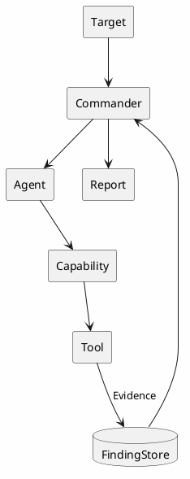

---

# 71. Definition of Done

IoTHunter v2 完成的最低标准：

```text
[ ] 可以创建 Workspace
[ ] 可以创建 Target
[ ] 可以配置不同 Agent 模型
[ ] Commander 可以创建 Task
[ ] Scheduler 可以派发 Agent
[ ] Agent 可以请求 Capability
[ ] Capability Registry 可以解析能力
[ ] Capability 可以选择实现
[ ] Capability 可以调用 Tool Gateway
[ ] Tool 可以在 Sandbox 中运行
[ ] Tool 执行受到权限控制
[ ] Recon 可以创建 Candidate Finding
[ ] Analysis 可以添加 Evidence
[ ] Validation 可以添加验证结果
[ ] Finding 可以按状态机流转
[ ] Finding Gate 可运行
[ ] Validation Gate 可运行
[ ] 高风险操作可以触发 Approval
[ ] Capability 可以独立测试
[ ] Tool Run 可审计
[ ] Agent Run 可审计
[ ] Capability Run 可审计
[ ] 任务失败后可恢复
[ ] 可以生成 SITREP
[ ] 可以生成 report.md
[ ] 可以沉淀 Vendor Profile
[ ] 可以加载 Workspace Skill
```

---

# 72. 最终架构定位

IoTHunter 不应该被实现成：

> 多个 Agent 顺序调用安全脚本的自动化流水线。

也不应该被实现成：

> Agent 可以直接执行任意系统能力的超级助手。

IoTHunter 应被实现为：

> **一个以 Finding / Evidence 为事实中心、以 Commander 为控制平面、以 Capability 为能力隔离边界、以 Tool Runtime 为安全执行底座、以多个 AI Agent 作为智能决策单元、以 Knowledge & Skill 作为持续复利机制的 IoT 漏洞研究 Harness。**

最终设计原则：

```text
Agent 负责思考
Capability 负责专业能力
Tool 负责实际执行
Harness 负责控制一切
Finding / Evidence 负责记录事实
Knowledge / Skill 负责复利
```

---

# 73. 一句话总结

> **IoTHunter 是一个 Capability-Isolated Multi-Agent IoT Vulnerability Research Harness：模型可替换、Agent 可扩展、Capability 可组合、Tool 可插拔、执行可隔离、Finding 可追溯、任务可恢复、权限可控制、知识可复用。**
