# IoTHunter Harness 架构设计文档

> 文档版本：v2.1  
> 项目名称：IoTHunter  
> 系统定位：Capability-Isolated Multi-Agent IoT Vulnerability Research Harness + Local Peripheral Orchestration  
> 目标读者：架构师、后端工程师、Agent 工程师、安全研究员、AI Coding Agent  
> 文档用途：作为 IoTHunter Harness 的总体架构、核心领域模型、工程边界与开发实施依据

---

# 1. 项目概述

IoTHunter 是一个面向 IoT 安全研究场景的多 Agent 漏洞挖掘 Harness。

系统通过 Commander 控制平面调度多个安全专家 Agent，并以 Capability 作为能力隔离边界，以 Tool Runtime 作为安全执行底座，围绕统一的 Finding / Evidence Store 持续积累漏洞线索、分析结果、验证证据和知识资产。

IoTHunter 不把 Agent 直接等同于执行器，而明确区分：

```text
Agent ≠ Capability ≠ Tool
```

其中：

```text
Agent       = 思考、决策、选择能力、评估结果
Capability  = 稳定、可测试、可复用的专业能力
Tool        = 实际执行底层命令、脚本、容器、设备操作
```

核心运行闭环：

```text
Target
  ↓
Commander
  ↓
Task
  ↓
Agent
  ↓
Capability
  ↓
Tool Runtime
  ↓
Evidence
  ↓
Finding
  ↓
Commander Decision
  ↓
Report / Knowledge / Skill
```

IoTHunter 的核心架构目标是：

> 模型可替换、Agent 可扩展、Capability 可组合、Tool 可插拔、执行可隔离、Finding 可追溯、任务可恢复、权限可控制、知识可复用。

---

# 2. 设计原则

## 2.1 Finding-Centric

Finding 是 IoTHunter 的第一核心领域对象。

Agent、Capability、Tool 都围绕 Finding 产生和消费证据。

一个潜在漏洞通常从：

```text
Hypothesis
```

逐渐演化为：

```text
Candidate
→ Analyzing
→ ReadyForValidation
→ Validating
→ Validated
→ Reportable
→ Reported
→ KnowledgeCaptured
```

任何关键结论都必须能够追溯到 Evidence。

---

## 2.2 Capability Isolation

Capability 是 IoTHunter 的能力边界。

Agent 不直接调用任意系统命令，不直接操作设备，不直接执行高风险行为。

Agent 只能请求 Capability：

```json
{
  "capability": "firmware.extract",
  "target": "artifact://firmware/xxx",
  "objective": "extract filesystem"
}
```

Capability 再通过 Tool Gateway 选择具体实现：

```text
firmware.extract
    ↓
Firmware Capability
    ↓
Tool Gateway
    ↓
binwalk / unblob / custom extractor
```

---

## 2.3 Control Plane / Execution Plane Separation

Go 负责 Harness 核心与调度控制。

Python 负责安全分析与专业能力实现。

推荐边界：

```text
Go
├── API Backend
├── Commander
├── Scheduler
├── Task Engine
├── Event Bus
├── Agent Lifecycle
├── Permission
├── Approval
├── Capability Registry
├── Tool Gateway
├── Device Manager
├── Audit
└── Worker Orchestration

Python
├── Firmware Capability
├── Binary Capability
├── Taint Capability
├── Protocol Capability
├── Fuzz Capability
├── Emulation Capability
├── AI Security Analysis
├── Knowledge Processing
└── Security Scripts
```

---

## 2.4 Structured Collaboration

Agent 之间不直接依赖长文本上下文。

统一通过结构化对象协作：

```text
Workspace
Target
Task
Agent
Capability
Tool
Finding
Evidence
Artifact
Skill
Event
Approval
```

---

## 2.5 Least Privilege

系统所有能力默认最小权限。

权限路径：

```text
Agent
  ↓
Capability
  ↓
Tool
  ↓
Resource
```

每一层都必须检查权限。

---

# 3. 总体架构

v2.1 在原有“能力隔离”基础上增加 **Desktop Client Runtime + Peripheral Plane**。

关键变化：

```text
AI Agent 不直接操作串口、程控电源、示波器、J-Link 或蓝牙分析仪。

Agent
  ↓
Capability
  ↓
Peripheral Capability / Tool Capability
  ↓
Permission + Safety Policy
  ↓
Peripheral Manager / Tool Gateway
  ↓
Driver Adapter
  ↓
Physical Peripheral
```

总体架构：

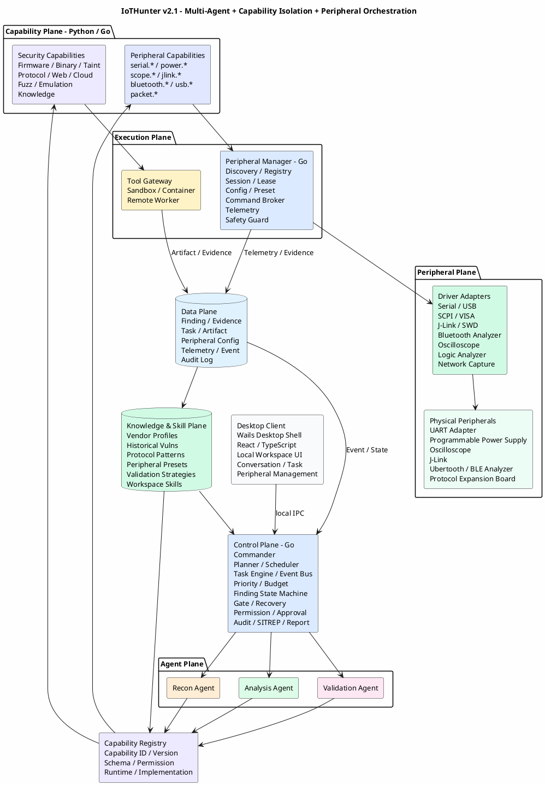

最重要的边界：

```text
Control Plane     = 决策、调度、权限
Agent Plane       = 思考、选择能力、评估结果
Capability Plane  = 标准化专业能力
Execution Plane   = 安全执行与设备编排
Peripheral Plane  = 外设抽象、驱动和物理连接
Data Plane        = 事实与状态
Knowledge Plane   = 可复用经验
```

# 4. 系统分层

IoTHunter v2.1 划分为八个逻辑平面：

```text
┌────────────────────────────────────────────┐
│ Desktop Client / UI                        │
│ Wails + React + TypeScript                 │
├────────────────────────────────────────────┤
│ Control Plane — Go                         │
├────────────────────────────────────────────┤
│ Agent Plane                                │
├────────────────────────────────────────────┤
│ Capability Plane                           │
├────────────────────────────────────────────┤
│ Execution Plane                            │
├────────────────────────────────────────────┤
│ Peripheral Plane                           │
├────────────────────────────────────────────┤
│ Data Plane                                 │
├────────────────────────────────────────────┤
│ Knowledge & Skill Plane                    │
└────────────────────────────────────────────┘
```

其中 Peripheral Plane 是 v2.1 的一级模块，不能仅作为普通 Tool 的一个分支。

原因：

- 外设具有真实连接状态；
- 一个设备通常需要排他锁；
- 参数配置具有设备级约束；
- 部分操作具有物理风险；
- 外设会持续产生 Telemetry；
- Agent、UI 和自动化流程可能同时需要访问设备；
- 串口、SCPI、SWD、BLE 等通信模型差异较大。

因此需要统一的 **Peripheral Manager** 管理生命周期，而不是让 Agent 或脚本直接打开 `/dev/ttyUSB0`、VISA Resource、USB Device 或 J-Link。

# 5. Desktop Client Layer

IoTHunter 是本地安全研究客户端，不以浏览器 Web SaaS 作为主要产品形态。

推荐：

```text
Wails
+
Go
+
React
+
TypeScript
```

原因：

- Harness Core 已采用 Go；
- Wails 可以直接复用 Go Control Plane；
- 前端仍可使用 React / TypeScript；
- 本地文件、USB、串口、设备访问更自然；
- 相比 Electron 运行时更轻；
- 可通过 Go API 暴露受控的本地系统能力。

桌面客户端模块：

```text
工作台
├── 对话与任务
├── 任务中心
├── 设备管理
└── 智能体管理

外设管理
├── 外设连接
├── 外设配置
└── 协议分析

漏洞管理
├── 漏洞列表
└── 漏洞知识库

配置
├── 运行时
├── Skills
└── 设置
```

其中：

### 外设连接

负责：

```text
发现外设
连接 / 断开
查看连接状态
串口终端
设备身份识别
实时数据
外设日志
```

### 外设配置

负责配置设备能力参数，例如：

```text
程控电源
- 最大输出电压
- 最大输出电流
- OVP
- OCP
- Ramp

示波器
- Sample Rate
- Timebase
- Trigger
- Channel
- Voltage Range

J-Link
- SWD / JTAG
- Clock
- Target Voltage
- Reset Strategy
- Device / Core

串口
- Baud Rate
- Data Bits
- Stop Bits
- Parity
- Flow Control

蓝牙分析仪
- Channel
- PHY
- Capture Mode
- Filter

协议扩展板
- Bus Type
- Voltage
- Clock
- Protocol Profile
```

### 本地 IPC

Frontend 不直接访问硬件。

推荐调用链：

```text
React UI
  ↓
Wails Binding / Local IPC
  ↓
Go Application Service
  ↓
Peripheral Manager
```

后续如需远程 Worker：

```text
Desktop
  ↓
Control Plane
  ↓
gRPC / NATS
  ↓
Remote Worker
```

# 6. Control Plane

Control Plane 是 IoTHunter 的大脑。

推荐使用 Go 实现。

## 6.1 主要组件

```text
Commander
Planner
Scheduler
Task Engine
Event Bus
Finding State Machine
Priority Engine
Budget Manager
Gate Engine
Recovery Manager
Permission Engine
Approval Manager
Capability Registry
Tool Gateway
Device Manager
Audit Service
SITREP Engine
Report Engine
Knowledge Curator
```

---

# 7. Commander

Commander 贯穿整个漏洞研究生命周期，不属于某一个阶段。

职责：

```text
理解 Target
分析当前 Finding
制定研究计划
拆解 Task
选择 Agent
选择优先级
选择是否继续投入
执行质量门控
控制预算
处理失败与回退
请求人工授权
生成 SITREP
生成报告
触发知识沉淀
```

Commander 不绑定具体模型。

```yaml
agent:
  role: commander

model:
  provider: user_defined
  name: user_defined
```

---

# 8. Commander 内部架构

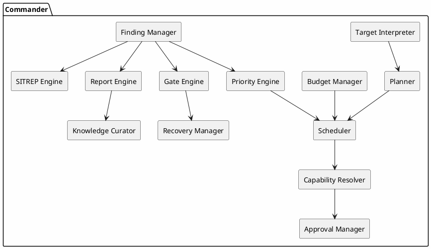

---

# 9. Agent Plane

Agent 是轻量化的智能决策单元。

Agent 主要负责四件事：

```text
Understand
Reason
Select Capability
Evaluate Result
```

Agent 不应：

```text
直接运行任意 shell
直接操作数据库
直接修改 Finding State
直接访问真实设备
直接执行高风险操作
```

---

# 10. Agent 类型

基础类型：

```text
commander
recon
analysis
validation
utility
```

专业 Agent 可以按需扩展：

```text
firmware
binary
web
android
cloud
nfc
ble
matter
baseband
hardware
```

专业 Agent 仍然通过 Capability 工作，不直接绑定具体 Tool。

---

# 11. Recon Agent Pool

Recon 负责提升高价值 Finding 的先验概率。

主要研究方向：

```text
Patch Intelligence
CVE / Advisory
Threat Intelligence
Historical Vulnerability
Similarity Inference
Attack Surface Discovery
Vendor Fingerprint
Component Fingerprint
```

典型输出：

```text
Hypothesis
Candidate Finding
Attack Surface
Candidate Component
Candidate Function
Priority Hint
Evidence
Recommended Task
```

---

# 12. Analysis Agent Pool

Analysis 负责将线索转化为具体漏洞路径和约束。

重点能力：

```text
Firmware Analysis
Binary Analysis
Taint Analysis
Protocol Analysis
Hidden Interface Reconstruction
Config Analysis
Cloud / App Correlation
Vendor-specific Analysis
```

Analysis 不要求自己实现这些能力。

它只负责选择 Capability，并解释 Capability 结果。

---

# 13. Validation Agent Pool

Validation 默认站在“误报复核”的立场。

主要职责：

```text
确认 Source 是否可控
确认路径是否可达
寻找遗漏约束
检查权限前提
评估漏洞机制
选择验证方式
评估动态结果
生成安全 PoC
分配 CWE
计算 CVSS
评估影响
```

Validation 通过 Capability 调用：

```text
fuzz.constraint
emulation.run
device.validate
packet.generate
poc.verify
cvss.score
```

---

# 14. Capability Plane

Capability 是 IoTHunter 的核心能力边界。

每一个 Capability 都必须定义：

```text
ID
Version
Input Schema
Output Schema
Permission
Runtime Requirement
Resource Requirement
Implementation
Timeout
Audit Policy
```

---

# 15. Capability Definition

示例：

```yaml
id: taint.trace
version: 1.2

category: analysis

description: trace tainted input to dangerous sink

input_schema:
  artifact: uri
  source: object
  sink: object

output_schema:
  taint_paths: array
  evidence: array
  confidence: number

permissions:
  network: false
  filesystem: readonly
  device: false
  destructive: false

runtime:
  isolation: container
  cpu: 4
  memory: 8G
  timeout: 1800

implementations:
  - angr
  - ghidra
  - custom
```

---

# 16. Capability Registry

Capability Registry 用于统一发现和解析能力。

推荐初始 Capability：

```text
firmware.extract
firmware.inventory
firmware.config_scan

binary.identify
binary.decompile
binary.callgraph
binary.xref
binary.search_string

taint.trace
taint.storage_trace

protocol.parse
protocol.attack_surface
protocol.hidden_interface

web.route_discovery
web.auth_analysis

config.audit

fuzz.constraint
fuzz.seed_generate

emulation.run

packet.generate
packet.replay

device.inspect
device.validate

serial.open
serial.read
serial.write
serial.configure

power.read
power.set_voltage
power.set_current
power.output
power.cycle
power.measure

scope.configure
scope.capture
scope.measure

jlink.attach
jlink.reset
jlink.halt
jlink.read_memory

bluetooth.capture
bluetooth.scan

packet.capture

poc.verify
cvss.score

knowledge.search
knowledge.pattern_match
```

---

# 17. Capability 选择流程

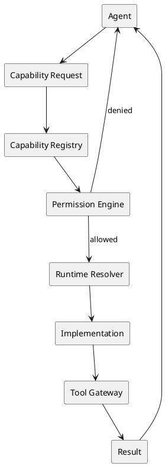

---

# 18. Capability 与 Skill 的区别

必须严格区分：

```text
Capability = 原子能力
Skill      = 多个 Capability 组合形成的方法论或工作流
```

示例：

```text
Capability:
  binary.search_string
  binary.xref
  taint.trace
```

Skill：

```text
hidden_web_api_discovery

1. firmware.extract
2. web.route_discovery
3. binary.search_string
4. binary.xref
5. protocol.hidden_interface
6. taint.trace
```

因此：

> Capability 类似 API，Skill 类似 Workflow。

---

# 19. Skill Definition

```yaml
name: hidden_web_api_discovery
version: 1.0

roles:
  - recon
  - analysis

steps:
  - capability: firmware.extract
  - capability: web.route_discovery
  - capability: binary.search_string
  - capability: binary.xref
  - capability: protocol.hidden_interface
  - capability: taint.trace

outputs:
  - finding
  - evidence

permissions:
  destructive: false
```

---

# 20. Execution Plane

Execution Plane 分为两条执行链：

```text
A. Software Tool Execution
Capability
  ↓
Tool Gateway
  ↓
Sandbox / Container / VM
  ↓
Tool

B. Physical Peripheral Execution
Capability
  ↓
Peripheral Manager
  ↓
Permission / Safety Guard
  ↓
Driver Adapter
  ↓
Physical Device
```

物理外设不应通过通用 Shell Tool 直接访问。

例如禁止：

```text
Agent -> shell -> echo > /dev/ttyUSB0
Agent -> shell -> vendor_cli --voltage 30
```

应改为：

```text
Agent
  ↓
power.set_output
  ↓
Peripheral Manager
  ↓
SCPI Adapter
  ↓
RIGOL DP832
```

这样权限、参数范围、日志、审计和设备锁都可以统一控制。

# 21. Tool Gateway 与 Peripheral Manager

IoTHunter v2.1 明确区分：

```text
Tool Gateway
  = 软件工具执行入口

Peripheral Manager
  = 真实外设执行入口
```

## 21.1 Tool Gateway

负责：

```text
binwalk
Ghidra
QEMU
Fuzzer
Python Scripts
Filesystem
Containerized Analysis
```

## 21.2 Peripheral Manager

负责：

```text
设备发现
设备注册
Driver Adapter 匹配
连接 / 断开
Session
Lease / Lock
参数读取
参数修改
命令执行
数据订阅
Telemetry
Preset
安全限制
审计
故障恢复
```

核心接口：

```go
type PeripheralManager interface {
    Discover(ctx context.Context) ([]Peripheral, error)
    Connect(ctx context.Context, id string) (*Session, error)
    Disconnect(ctx context.Context, sessionID string) error

    GetSchema(ctx context.Context, id string) (ConfigSchema, error)
    GetConfig(ctx context.Context, sessionID string) (map[string]any, error)
    ApplyConfig(ctx context.Context, sessionID string, cfg map[string]any) error

    Invoke(ctx context.Context, req PeripheralInvokeRequest) (PeripheralResult, error)
    Subscribe(ctx context.Context, sessionID string, topics []string) (<-chan TelemetryEvent, error)
}
```

# 22. Tool / Peripheral Driver Definition

普通 Tool：

```yaml
name: binwalk
category: firmware

execution:
  type: container

permissions:
  network: false
  filesystem: workspace
  device: false

timeout: 600
```

物理外设采用独立 Driver Definition：

```yaml
id: rigol.dp832
kind: programmable_power_supply

transport:
  - usb_visa
  - lan_scpi

driver:
  protocol: scpi

capabilities:
  - power.read
  - power.set_voltage
  - power.set_current
  - power.output
  - power.measure

config_schema:
  channel:
    type: enum
    values: [CH1, CH2, CH3]

  max_voltage:
    type: number
    unit: V
    minimum: 0
    maximum: 32

  max_current:
    type: number
    unit: A
    minimum: 0
    maximum: 3.2

safety:
  requires_approval_above:
    voltage: 12
    current: 2

  emergency_action:
    - output_off
```

所有设备参数范围应来自 Driver/Profile，而不是由 LLM 自由生成。

# 23. Tool 与 Peripheral 类型

## Software Tool

```text
filesystem
shell
python
git
web
binary_analysis
decompiler
firmware_extract
protocol_parser
fuzzer
emulator
custom
```

## Peripheral

```text
serial
usb
programmable_power_supply
oscilloscope
logic_analyzer
jlink
swd
jtag
bluetooth_analyzer
wifi_adapter
network_capture
protocol_expansion_board
custom_lab_device
```

## Transport

底层传输统一抽象：

```text
Serial
USB
HID
VISA
SCPI
TCP
UDP
BLE
Vendor SDK
CLI Bridge
```

# 24. Sandbox 与硬件访问边界

软件 Tool 默认运行在：

```text
Docker / Podman
```

但外设访问不应默认把宿主机全部 USB/Serial 权限暴露给容器。

推荐：

```text
Physical Peripheral
      ↓
Host Peripheral Service
      ↓
Narrow IPC / RPC
      ↓
Capability Worker
```

只有必要场景才做受限设备透传，例如：

```text
/dev/ttyUSB0
/dev/hidrawX
USB VID/PID
```

透传必须：

```text
显式 Device Allowlist
+
Task Permission
+
Capability Permission
+
Peripheral Lease
+
Audit
```

Production 可扩展：

```text
Remote Lab Worker
Firecracker
KVM
USB/IP
Network-isolated Hardware Lab
```

# 25. Capability Worker 模型

Capability 分为三类：

```text
1. Light Software Capability
2. Heavy Software Capability
3. Peripheral Capability
```

Light：

```text
Knowledge Search
Metadata
Config Parser
CVE Intelligence
```

Heavy：

```text
Firmware Extraction
Decompiler
Taint Analysis
QEMU
Fuzzing
```

Peripheral Capability：

```text
serial.console
power.cycle
power.measure
scope.capture
jlink.attach
jlink.read_memory
bluetooth.capture
packet.capture
```

Peripheral Capability 通常不直接持有设备句柄。

设备句柄必须由 Peripheral Manager 管理。

# 26. Peripheral Manager / Device Manager

v2.1 将原 Device Manager 拆分为两个概念：

```text
Target Device Manager
= 被研究的 IoT 目标设备

Peripheral Manager
= 用于研究目标的实验室外设
```

两者不能混在同一个 Device 表中。

## 26.1 Target Device

示例：

```text
TP-Link Router
Smart Lock
POS
NFC Reader
Camera
Matter Device
```

## 26.2 Peripheral

示例：

```text
USB UART
RIGOL DP832
Oscilloscope
J-Link
Ubertooth
Logic Analyzer
Protocol Expansion Board
```

Peripheral Schema：

```json
{
  "peripheral_id": "P-001",
  "driver_id": "rigol.dp832",
  "kind": "programmable_power_supply",

  "name": "DP832-LAB-01",

  "transport": {
    "type": "usb_visa",
    "address": "USB0::0x1AB1::..."
  },

  "identity": {
    "vendor": "RIGOL",
    "model": "DP832",
    "serial": ""
  },

  "status": "connected",

  "config": {},

  "capabilities": [
    "power.read",
    "power.set_voltage",
    "power.set_current",
    "power.output"
  ],

  "lease": null,

  "authorization": {
    "allow_automation": true
  }
}
```

## 26.3 Peripheral Session / Lease

所有写操作必须持有 Session。

```json
{
  "session_id": "PS-001",
  "peripheral_id": "P-001",
  "owner_type": "task",
  "owner_id": "TASK-001",
  "mode": "exclusive",
  "expires_at": ""
}
```

串口监听等场景可以：

```text
shared-read
```

程控电源/J-Link 写操作默认：

```text
exclusive
```

避免 UI、Agent、自动化脚本同时修改同一个外设。

# 27. 外设权限与 Human Approval

不是所有外设动作都需要人工审批，但必须区分风险等级。

建议：

```text
L0 Read Only
- 查询设备信息
- 读取串口
- 读取功耗
- 示波器采样

L1 Controlled Write
- 修改波特率
- 修改采集频率
- 调整非危险参数

L2 Physical Impact
- Power Cycle
- 输出电压/电流
- Reset Target
- SWD/JTAG Halt

L3 High Risk
- Flash Write
- Fuse / OTP
- Persistent Config Write
- Destructive Test
```

策略：

```text
L0 直接执行
L1 根据 Workspace Policy
L2 需要授权策略或人工审批
L3 默认必须 Human Approval
```

特别是程控电源必须配置硬限制：

```text
global_max_voltage
global_max_current
per_target_voltage
per_target_current
```

LLM 请求超过上限时必须拒绝，而不是弹审批绕过硬限制。

# 28. 外设调用流程

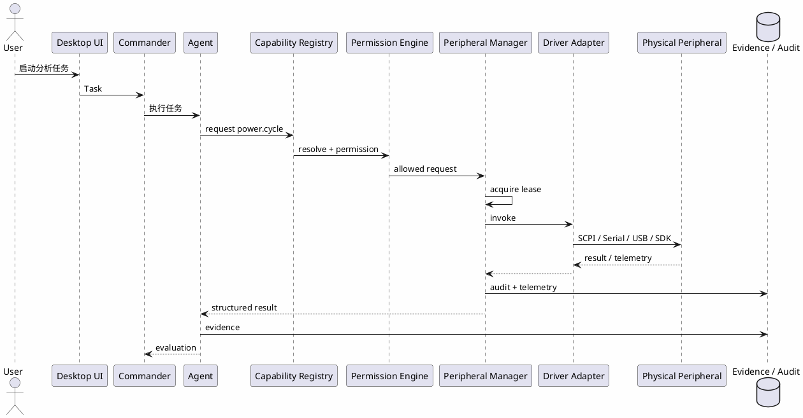

UI 手动调用和 Agent 自动调用使用同一 Peripheral Manager。

差别只在 Caller：

```text
caller=user
caller=task
caller=agent
caller=skill
```

这样所有调用都具有统一权限、锁和审计。


# 28.1 Peripheral Plane 详细设计

Peripheral Plane 是 IoTHunter 与真实实验环境的边界。

## 28.1.1 四层结构

```text
Peripheral Capability
        ↓
Peripheral Manager
        ↓
Driver Adapter
        ↓
Transport
        ↓
Physical Peripheral
```

例如程控电源：

```text
power.set_voltage
        ↓
Peripheral Manager
        ↓
RigolDP832Adapter
        ↓
SCPI over VISA
        ↓
DP832
```

例如 J-Link：

```text
jlink.read_memory
        ↓
Peripheral Manager
        ↓
JLinkAdapter
        ↓
Vendor SDK / CLI
        ↓
J-Link Probe
        ↓
Target
```

## 28.1.2 Adapter 接口

```go
type PeripheralAdapter interface {
    Match(info DiscoveryInfo) bool
    Open(ctx context.Context, endpoint Endpoint) (PeripheralHandle, error)
    Close(ctx context.Context, handle PeripheralHandle) error

    Identity(ctx context.Context, handle PeripheralHandle) (Identity, error)
    Schema(ctx context.Context, handle PeripheralHandle) (ConfigSchema, error)

    ReadConfig(ctx context.Context, handle PeripheralHandle) (map[string]any, error)
    ApplyConfig(ctx context.Context, handle PeripheralHandle, cfg map[string]any) error

    Invoke(ctx context.Context, handle PeripheralHandle, command string, args map[string]any) (Result, error)
}
```

## 28.1.3 自动发现

Discovery Provider：

```text
Serial Enumerator
USB Enumerator
VISA Enumerator
LAN SCPI Discovery
Bluetooth Adapter Discovery
Vendor SDK Discovery
```

发现结果只代表“设备存在”，不能自动授予调用权限。

## 28.1.4 配置 Schema

外设配置页面不能针对每个设备硬编码全部表单。

建议由 Driver 返回 JSON Schema / UI Schema：

```json
{
  "type": "object",
  "properties": {
    "max_voltage": {
      "type": "number",
      "minimum": 0,
      "maximum": 32,
      "unit": "V"
    },
    "max_current": {
      "type": "number",
      "minimum": 0,
      "maximum": 3.2,
      "unit": "A"
    }
  }
}
```

Desktop UI 根据 Schema 动态生成：

```text
输入框
Dropdown
Toggle
Channel Selector
Preset
单位
范围提示
```

这样新接入设备通常只需要增加 Driver/Profile，不需要重写 UI。

## 28.1.5 Preset

支持用户保存：

```text
UART 115200 8N1
DP832 3.3V / 1A
DP832 5V / 2A
J-Link SWD 4MHz
Scope 100MHz Sample
BLE Capture Profile
```

Preset 是配置模板，不自动绕过安全策略。

## 28.1.6 Telemetry

统一格式：

```json
{
  "peripheral_id": "P-001",
  "session_id": "PS-001",
  "timestamp": "",
  "topic": "power.measurement",
  "values": {
    "voltage": 5.01,
    "current": 0.12,
    "power": 0.601
  }
}
```

常见 Topic：

```text
serial.rx
serial.tx
power.measurement
scope.measurement
scope.waveform
bluetooth.packet
bluetooth.rssi
jlink.target_state
device.connection
```

## 28.1.7 外设证据化

Agent 请求的实验操作如果和漏洞验证有关，结果应可以转为 Evidence。

例如：

```text
power.cycle
→ target rebooted
→ UART boot log
→ service entered vulnerable state
```

最终 Evidence 可以关联：

```text
Power Command Artifact
Serial Log
Timestamp
Target State
Validation Finding
```

因此外设不仅是“设备管理功能”，还是 Validation Evidence 的来源。


# 29. Data Plane

Data Plane 保存系统事实。

组成：

```text
Finding Store
Evidence Store
Task Store
Artifact Store
Event Store
Audit Log
Agent Run Store
Approval Store
```

推荐：

```text
PostgreSQL
+
Object Storage
+
Optional Vector DB
```

---

# 30. Finding Schema

```json
{
  "finding_id": "F-2026-000001",
  "workspace_id": "W-001",
  "target_id": "T-001",

  "title": "",

  "state": "candidate",
  "priority": "P1",
  "confidence": 0.72,

  "attack_surface": {
    "type": "",
    "protocol": "",
    "entrypoint": ""
  },

  "location": {
    "component": "",
    "binary": "",
    "file": "",
    "function": "",
    "offset": ""
  },

  "source": [],
  "sink": [],
  "call_chain": [],
  "taint_path": [],
  "constraints": [],

  "cwe": [],

  "evidence_ids": [],
  "artifact_ids": [],

  "validation": {
    "state": "not_started",
    "method": null,
    "reproducible": false,
    "result": null
  },

  "poc": null,
  "cvss": null,
  "impact": null,

  "assigned_agents": [],

  "created_at": "",
  "updated_at": ""
}
```

---

# 31. Evidence Schema

```json
{
  "evidence_id": "E-000001",

  "finding_id": "F-2026-000001",

  "type": "taint_path",

  "source": {
    "agent_id": "analysis-01",
    "task_id": "TASK-01",
    "capability_id": "taint.trace",
    "tool_run_id": "TOOLRUN-01"
  },

  "confidence": 0.93,

  "content": {},

  "artifact_refs": [],

  "created_at": ""
}
```

Evidence 类型：

```text
patch_diff
vendor_advisory
cve
function
source
sink
call_chain
taint_path
constraint
protocol_field
config
binary_offset
packet
crash
stack_trace
log
screenshot
poc
dynamic_result
manual_review
```

---

# 32. Artifact Store

大型结果统一放 Artifact Store。

保存：

```text
Firmware
Extracted Filesystem
Binary
Decompiler Output
Packet Capture
Crash Dump
Screenshot
PoC
Harness
Seed Corpus
Report
Logs
```

数据库只保存：

```text
artifact_id
sha256
path
type
metadata
```

---

# 33. Finding 生命周期

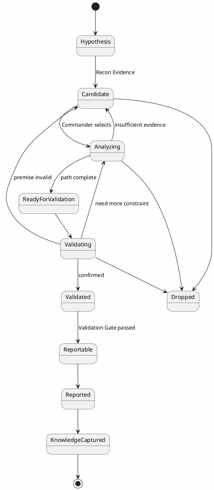

---

# 34. Task Model

所有 Agent 工作都通过 Task 驱动。

```json
{
  "task_id": "TASK-001",

  "workspace_id": "W-001",
  "finding_id": "F-001",

  "type": "analysis.taint",

  "objective": "确认外部输入是否到达危险调用",

  "priority": "P0",

  "status": "queued",

  "assigned_agent": null,

  "required_capabilities": [
    "taint.trace"
  ],

  "context": {
    "evidence_ids": [],
    "artifact_ids": []
  },

  "budget": {
    "max_tokens": 30000,
    "max_runtime_seconds": 1800,
    "max_tool_calls": 100
  },

  "permissions": {
    "network": false,
    "device": false,
    "destructive": false
  }
}
```

---

# 35. Task 生命周期

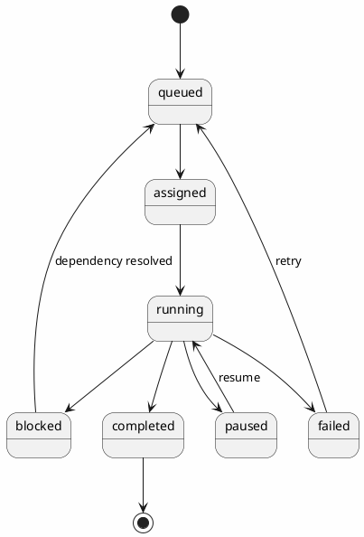

---

# 36. Event Bus

系统内部推荐事件驱动。

主要事件：

```text
workspace.created
target.created
target.indexed

task.created
task.started
task.completed
task.failed
task.blocked

finding.created
finding.updated
finding.promoted
finding.dropped

evidence.added

capability.started
capability.completed
capability.failed

tool.started
tool.completed
tool.failed

validation.started
validation.completed

gate.passed
gate.failed

report.generated

knowledge.updated

human.approval.required
human.approval.granted
human.approval.denied
```

---


## 36.1 外设事件

新增事件：

```text
peripheral.discovered
peripheral.connected
peripheral.disconnected
peripheral.config.changed
peripheral.session.opened
peripheral.session.closed
peripheral.command.started
peripheral.command.completed
peripheral.command.failed
peripheral.telemetry
peripheral.safety.denied
peripheral.approval.required
peripheral.error
```

Telemetry 必须和普通 Audit/Event 区分。

高频数据例如示波器波形、BLE 捕获包不直接写 Event Store；应进入 Artifact/Telemetry Storage，Event 只记录引用。

# 37. Scheduler

Scheduler 不直接理解安全逻辑。

它根据：

```text
Priority
Agent Capacity
Capability Availability
Dependency
Budget
Permission
Resource Requirement
Device Availability
Target Lock
```

进行调度。

MVP：

```text
Priority Queue + Worker Pool
```

Production：

```text
Capability-aware Scheduling
Cost-aware Scheduling
Model Routing
Remote Worker Scheduling
```

---

# 38. 动态并发

禁止硬编码固定 Agent 并发。

推荐：

```yaml
agent_pool:
  global_max_workers: 8

  recon:
    min: 0
    max: 4

  analysis:
    min: 0
    max: 6

  validation:
    min: 0
    max: 4
```

Capability Worker 独立配置：

```yaml
capability_pool:
  firmware.extract:
    max: 2

  binary.decompile:
    max: 2

  taint.trace:
    max: 4

  fuzz.constraint:
    max: 2

  emulation.run:
    max: 1
```

---

# 39. Finding Priority

推荐：

```text
Score =
Impact
× Reachability
× Confidence
× Exploitability
× IntelligenceQuality
÷ ValidationCost
```

内部可统一归一化到：

```text
0 ~ 100
```

Commander 优先推进：

```text
高影响
+
高可达
+
多证据收敛
+
低验证成本
```

的 Finding。

---

# 40. Quality Gate

v2 仍保留两个核心 Gate。

## 40.1 Finding Gate

判断 Finding 是否值得继续投入。

规则示例：

```text
存在具体攻击面

AND

至少一个有效 Evidence

AND

存在明确组件 / 函数 / 协议对象

AND

Confidence >= threshold

AND

Priority >= threshold
```

输出：

```text
PASS
HOLD
DROP
NEED_MORE_INTEL
```

---

## 40.2 Validation Gate

判断是否达到报告标准。

建议：

```text
Mechanism Complete
Reachability Confirmed
CWE Assigned
Reproducible
Evidence Complete
Impact Defined
PoC Safe
CVSS Ready
```

输出：

```text
REPORTABLE
NEED_MORE_ANALYSIS
NEED_MORE_VALIDATION
REJECTED
```

---

# 41. Gate 回退

```plantuml
@startuml Gate_Fallback_v2
skinparam backgroundColor #FEFEFE
skinparam defaultFontName "Microsoft YaHei"

rectangle "Candidate" as CANDIDATE
diamond "Finding Gate" as FG
rectangle "Analysis" as ANALYSIS
rectangle "Validation" as VALIDATION
diamond "Validation Gate" as VG
rectangle "Report" as REPORT
rectangle "Hold" as HOLD

CANDIDATE --> FG
FG --> ANALYSIS : PASS
FG --> HOLD : HOLD / DROP
ANALYSIS --> VALIDATION
VALIDATION --> VG
VG --> REPORT : REPORTABLE
VG --> ANALYSIS : NEED_MORE_ANALYSIS
VG --> VALIDATION : NEED_MORE_VALIDATION
VG --> CANDIDATE : premise unclear
@enduml
```

---

# 42. Knowledge & Skill Plane

知识层主要保存：

```text
Vendor Profile
Historical Vulnerability
Dangerous API
Protocol Pattern
Taint Pattern
Validation Strategy
Fuzz Seed
Harness
Workspace Skill
```

知识只能作为辅助推理来源。

不得直接作为漏洞事实。

---

# 43. Vendor Profile

```json
{
  "vendor": "",

  "components": [],
  "services": [],
  "protocols": [],
  "config_system": [],
  "dangerous_apis": [],
  "historical_vulns": [],
  "auth_patterns": [],
  "known_paths": [],
  "skills": []
}
```

---

# 44. Vulnerability Pattern

```json
{
  "pattern_id": "",
  "category": "stored_taint",

  "source_type": "http",
  "storage": "nvram",
  "sink": "sprintf",

  "cwe": "CWE-120"
}
```

例如：

```text
HTTP Input
   ↓
config_set()
   ↓
NVRAM
   ↓
reboot
   ↓
config_load()
   ↓
sprintf()
```

---

# 45. Knowledge 回灌

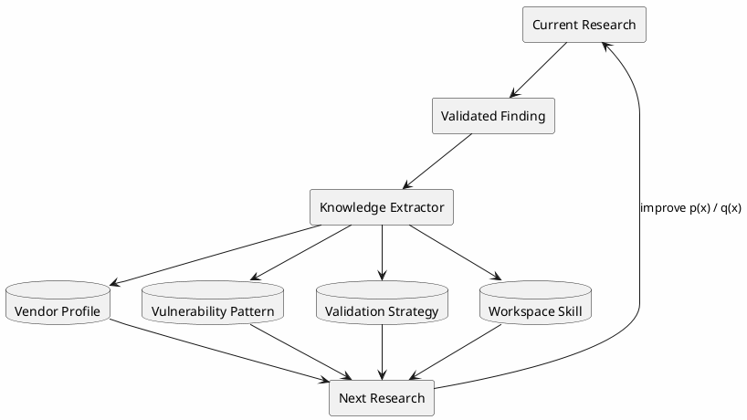

---

# 46. Workspace

每个研究项目对应一个 Workspace。

```text
Workspace
  id
  name
  owner
  targets
  findings
  tasks
  evidence
  artifacts
  approvals
  reports
  knowledge
```

推荐目录：

```text
workspace/

├── manifest.yaml

├── targets/
│   ├── firmware/
│   ├── filesystem/
│   └── metadata/

├── findings/

├── evidence/
│   ├── static/
│   ├── dynamic/
│   ├── packet/
│   └── manual/

├── artifacts/
│   ├── binary/
│   ├── poc/
│   ├── fuzz/
│   ├── harness/
│   └── reports/

├── tasks/

├── capabilities/

├── knowledge/

├── skills/

├── approvals/

├── peripherals/
│   ├── profiles/
│   ├── presets/
│   ├── sessions/
│   └── telemetry/

├── logs/

└── sitrep/
```

---

# 47. Model Registry

所有 Agent 的模型必须可配置。

禁止写死模型名称。

```yaml
models:

  commander:
    provider: openai_compatible
    model: user_defined

  recon:
    provider: user_defined
    model: user_defined

  analysis:
    provider: user_defined
    model: user_defined

  validation:
    provider: user_defined
    model: user_defined
```

统一接口：

```go
type ModelAdapter interface {
    Chat(ctx context.Context, req ChatRequest) (ChatResponse, error)
}
```

可支持：

```text
OpenAI-compatible
Anthropic
Gemini
Local Model
Custom HTTP Endpoint
```

---

# 48. Prompt 管理

Prompt 必须版本化。

```text
prompts/

├── commander/
│   ├── planner_v1.md
│   ├── gate_v1.md
│   └── recovery_v1.md

├── recon/

├── analysis/

└── validation/
```

保存：

```text
prompt_name
prompt_version
sha256
```

---

# 49. Structured Output

所有核心 Agent 输出优先采用结构化 Schema。

例如：

```json
{
  "summary": "",
  "new_findings": [],
  "evidence": [],
  "capability_requests": [],
  "recommended_tasks": [],
  "confidence": 0.0
}
```

禁止使用自然语言文本作为关键状态唯一来源。

---

# 50. Capability Request

统一结构：

```json
{
  "request_id": "",

  "task_id": "",

  "agent_id": "",

  "capability_id": "taint.trace",

  "objective": "",

  "inputs": {},

  "constraints": {},

  "permissions": {},

  "budget": {}
}
```

---

# 51. Capability Result

```json
{
  "request_id": "",

  "capability_id": "taint.trace",

  "status": "completed",

  "summary": "",

  "evidence": [],

  "artifacts": [],

  "confidence": 0.9,

  "metrics": {
    "runtime_ms": 0
  }
}
```

---

# 52. Recon 工作流

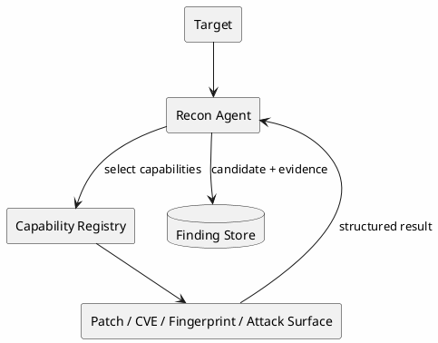

---

# 53. Analysis 工作流

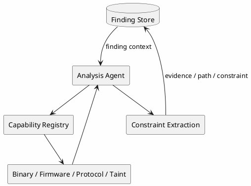

---

# 54. Validation 工作流

```plantuml
@startuml Validation_Workflow_v2
skinparam backgroundColor #FEFEFE
skinparam defaultFontName "Microsoft YaHei"

database "Finding Store" as STORE
rectangle "Validation Agent" as AGENT
diamond "Plausible?" as P
rectangle "Capability Registry" as REG
rectangle "Fuzz / Emulation / Device / PoC" as CAP
rectangle "Validation Evidence" as EVIDENCE

STORE --> AGENT
AGENT --> P
P --> STORE : No / downgrade
P --> REG : Yes
REG --> CAP
CAP --> AGENT
AGENT --> EVIDENCE
EVIDENCE --> STORE
@enduml
```

---

# 55. 完整运行时序

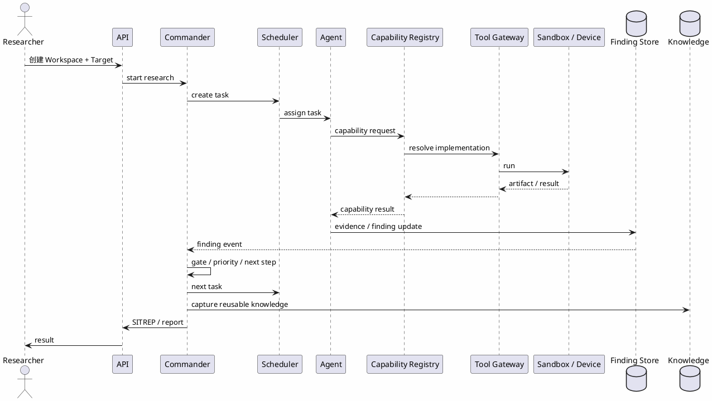

---

# 56. 数据库设计

推荐：

```text
PostgreSQL
+
Object Storage
+
Optional Vector DB
```

建议表：

```text
workspaces
targets
agents
agent_runs
tasks
task_dependencies
capabilities
capability_runs
tools
tool_runs
findings
finding_relations
evidence
artifacts
validations
gate_decisions
approvals
events
knowledge_items
skills
model_configs
tool_configs
audit_logs
```

---

# 57. Application Service / API 设计

IoTHunter v2.1 是本地客户端，业务入口分为：

```text
React UI
  ↓
Wails Bindings / Local IPC
  ↓
Go Application Services
```

不要求所有本地操作都走 HTTP。

核心 Application Service：

```text
WorkspaceService
TaskService
AgentService
FindingService
PeripheralService
CapabilityService
RuntimeService
KnowledgeService
```

PeripheralService：

```go
type PeripheralService interface {
    List(ctx context.Context) ([]PeripheralDTO, error)
    Discover(ctx context.Context) ([]PeripheralDTO, error)

    Connect(ctx context.Context, id string) (SessionDTO, error)
    Disconnect(ctx context.Context, sessionID string) error

    GetConfigSchema(ctx context.Context, id string) (ConfigSchemaDTO, error)
    GetConfig(ctx context.Context, sessionID string) (map[string]any, error)
    ApplyConfig(ctx context.Context, sessionID string, cfg map[string]any) error

    Invoke(ctx context.Context, req InvokeDTO) (InvokeResultDTO, error)
}
```

如果后续提供 HTTP API：

```text
GET  /api/v1/peripherals
POST /api/v1/peripherals/discover

POST /api/v1/peripherals/{id}/connect
POST /api/v1/peripheral-sessions/{id}/disconnect

GET  /api/v1/peripherals/{id}/schema
GET  /api/v1/peripheral-sessions/{id}/config
PUT  /api/v1/peripheral-sessions/{id}/config

POST /api/v1/peripheral-sessions/{id}/invoke

GET  /api/v1/peripheral-sessions/{id}/telemetry
```

Telemetry：

```text
Wails Event
or
SSE / WebSocket
```

高频波形/PCAP 使用 Artifact 引用，不通过 JSON Event 持续传大对象。

# 58. 内部 RPC / Worker 通信

推荐：

```text
Control Plane ↔ Worker

gRPC / NATS / HTTP internal API
```

MVP 可用 HTTP / JSON。

Production 建议：

```text
gRPC + Event Bus
```

---

# 59. 审计日志

必须记录：

```text
谁
什么时候
创建什么 Task
调用什么 Agent
Agent 使用什么模型
请求什么 Capability
Capability 选择什么 Implementation
调用什么 Tool
Tool 执行什么命令
访问什么 Resource
生成什么 Evidence
修改什么 Finding
谁批准高风险操作
```

Audit Log 必须 append-only。

Agent 无权删除或覆盖。

---

# 60. 可观测性

推荐：

```text
OpenTelemetry
Prometheus
Grafana
Structured Logging
```

指标：

```text
Task Success Rate
Task Runtime
Queue Depth
Agent Utilization
Capability Runtime
Tool Runtime
Model Cost
Finding Conversion
Validation Success
Retry Count
Device Utilization
Approval Wait Time
```

---

# 61. 异常恢复

必须处理：

```text
Model Timeout
Model Provider Error
Invalid Structured Output
Capability Failure
Tool Crash
Tool Timeout
Worker Crash
Container Crash
Network Failure
Device Offline
Artifact Missing
Database Error
Context Overflow
```

---

# 62. Retry Policy

推荐：

```text
Model transient error:
  exponential retry <= 3

Invalid structured output:
  repair once

Capability transient failure:
  retry by policy

Tool timeout:
  retry <= 1

Validation failure:
  no blind retry
  return to Commander

Device failure:
  block task
  require recovery
```

---

# 63. Context Management

Agent 上下文只加载必要信息：

```text
Task Objective
Finding Summary
Relevant Evidence
Relevant Artifact Index
Relevant Knowledge
Relevant Skill
Recent Decisions
Capability Catalog
Permission Context
```

禁止每次注入整个 Workspace。

---

# 64. Retrieval

知识检索：

```text
Metadata Filter
+
Keyword
+
Vector Similarity
```

推荐优先级：

```text
Vendor / Model
Component
Protocol
Function
CWE
Historical Finding
Semantic Similarity
```

检索结果仅作为参考。

---

# 65. 技术栈

## Desktop Client

```text
Wails v2+
React
TypeScript
Tailwind CSS
```

Wails Go Runtime 负责本地能力和外设访问，React 只负责 UI。

## Core Backend

```text
Go
Gin / Echo / Fiber / net/http
sqlc / GORM
OpenTelemetry
```

优先推荐：

```text
Go + net/http / chi
```

保持核心 Harness 简洁。

## Capability Runtime

```text
Python 3.12+
Pydantic
asyncio
```

按能力选择：

```text
angr
pwntools
Ghidra scripting
QEMU
binwalk / unblob
custom scripts
```

## Infrastructure

```text
PostgreSQL
Redis / NATS
MinIO / S3
Docker / Podman
```

---

# 66. 推荐代码目录

```text
iothunter/

├── desktop/
│   ├── frontend/          # React / TypeScript
│   └── wails/             # Desktop binding

├── cmd/
│   ├── api/
│   ├── worker/
│   └── cli/

├── internal/
│   ├── commander/
│   │   ├── planner/
│   │   ├── scheduler/
│   │   ├── priority/
│   │   ├── gate/
│   │   ├── recovery/
│   │   ├── sitrep/
│   │   └── report/
│   │
│   ├── agents/
│   │   ├── registry/
│   │   ├── runtime/
│   │   └── lifecycle/
│   │
│   ├── capabilities/
│   │   ├── registry/
│   │   ├── resolver/
│   │   └── schemas/
│   │
│   ├── tools/
│   │   ├── gateway/
│   │   ├── permission/
│   │   └── runtime/
│   │
│   ├── devices/          # Target Device
│   │
│   ├── peripherals/
│   │   ├── manager/
│   │   ├── registry/
│   │   ├── session/
│   │   ├── safety/
│   │   ├── telemetry/
│   │   └── adapters/
│   │       ├── serial/
│   │       ├── scpi/
│   │       ├── visa/
│   │       ├── jlink/
│   │       ├── bluetooth/
│   │       └── usb/
│   │
│   ├── findings/
│   │
│   ├── evidence/
│   │
│   ├── tasks/
│   │
│   ├── approvals/
│   │
│   ├── knowledge/
│   │
│   ├── skills/
│   │
│   ├── storage/
│   │
│   ├── events/
│   │
│   ├── audit/
│   │
│   └── observability/
│
├── capability-workers/
│   ├── firmware/
│   ├── binary/
│   ├── taint/
│   ├── protocol/
│   ├── fuzz/
│   ├── emulation/
│   └── knowledge/
│
├── prompts/
│
├── schemas/
│
├── migrations/
│
└── tests/
```

---

# 67. 核心领域对象

IoTHunter v2.1 建议固定以下核心对象：

```text
Workspace
Target
Task
Agent
Capability
Tool
Finding
Evidence
Artifact
Skill
Event
Approval

Peripheral
PeripheralDriver
PeripheralProfile
PeripheralSession
PeripheralPreset
Telemetry
```

其中必须区分：

```text
Target
= 被研究对象

Peripheral
= 研究过程中使用的实验室设备
```

例如：

```text
Target:
TP-Link AX73

Peripherals:
USB UART
RIGOL DP832
J-Link
Oscilloscope
Ubertooth
```

最核心的运行对象：

```text
Task
Finding
Evidence
Capability
Peripheral Session
Tool Runtime
Commander
```

# 68. AI Coding Agent 开发约束

AI 开发本系统时必须遵循：

1. Finding 是核心事实对象；
2. Evidence 是所有结论的来源；
3. Agent 不直接修改数据库；
4. Agent 不直接调用任意 Tool；
5. Agent 必须通过 Capability 访问专业能力；
6. Capability 必须有明确输入输出 Schema；
7. Capability 必须有权限声明；
8. Capability 必须可以独立测试；
9. Tool 必须通过 Tool Gateway；
10. Tool 必须经过 Permission Check；
11. Tool 默认运行在 Sandbox；
12. 模型不得硬编码；
13. Agent 并发数不得硬编码；
14. Capability 并发数不得硬编码；
15. Finding State 必须由状态机控制；
16. Evidence 不允许静默覆盖；
17. Artifact 必须计算 hash；
18. Prompt 必须版本化；
19. Task 必须可重试、暂停、恢复；
20. 高风险真实设备操作必须支持 Human Approval；
21. 所有执行必须生成 Audit Log；
22. Knowledge Retrieval 结果不得直接当作事实；
23. Validation Agent 默认以误报复核立场工作；
24. Commander 是唯一全局调度决策中心；
25. Scheduler 不承担安全业务判断；
26. Capability 不承担全局研究决策；
27. Tool 不承担业务逻辑；
28. Execution Plane 不直接修改 Finding State；
29. 所有关键结论必须可追溯至 Evidence；
30. 所有权限默认最小化；
31. Agent 不允许直接打开串口、USB、VISA、J-Link；
32. 所有物理外设访问必须通过 Peripheral Manager；
33. Target Device 与 Peripheral 必须使用不同领域对象；
34. 外设写操作必须持有 Lease；
35. 所有外设参数必须通过 Config Schema 校验；
36. 程控电源等设备必须支持不可绕过的硬安全上限；
37. UI 手动调用与 Agent 自动调用必须复用同一 Peripheral Service；
38. 外设 Telemetry 与 Audit Event 必须分离；
39. 物理设备断连后必须自动使 Session 失效；
40. Capability 不得长期持有原始设备句柄。

---

# 69. MVP 开发计划

## Phase 1：Harness Core

实现：

```text
Workspace
Target
Task
Finding
Evidence
Agent Runtime
Model Adapter
Commander
Scheduler
Event Bus
```

目标：

> 完成 Target → Task → Agent → Finding 的最小闭环。

---

## Phase 2：Capability & Peripheral Isolation

实现：

```text
Capability Registry
Capability Request / Result
Capability Worker
Tool Gateway
Permission Engine
Sandbox

Peripheral Manager
Peripheral Registry
Serial Adapter
SCPI Adapter
Peripheral Session / Lease
Config Schema
Telemetry
```

目标：

> 同时完成 Agent → Capability → Tool → Evidence 与 Agent → Peripheral Capability → Peripheral Manager → Hardware → Evidence 两条安全执行链。

---

## Phase 3：Validation

实现：

```text
Validation Agent
fuzz.constraint
emulation.run
device.validate
Approval
Validation Gate
```

---

## Phase 4：Knowledge & Skill

实现：

```text
Vendor Profile
Vulnerability Pattern
Skill
Knowledge Retrieval
Knowledge Feedback
```

---

## Phase 5：Platform

实现：

```text
Web UI
SITREP
Report
Metrics
Distributed Worker
Dynamic Scheduling
Advanced Device Manager
```

---

# 70. MVP 最小闭环

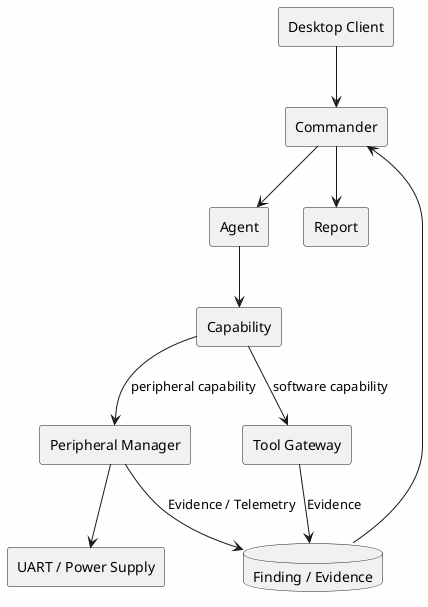

外设 MVP 建议第一批只支持：

```text
1. Serial / UART
2. SCPI Programmable Power Supply
3. J-Link 基础连接
```

第二批再支持：

```text
Oscilloscope
Bluetooth Analyzer
Logic Analyzer
Protocol Expansion Board
```

这样可以先把统一外设抽象、Session/Lease、参数 Schema 和调用链做稳定。

# 71. Definition of Done

IoTHunter v2 Harness 完成的最低标准：

```text
[ ] 可以创建 Workspace
[ ] 可以创建 Target
[ ] 可以配置不同 Agent 模型
[ ] Commander 可以创建 Task
[ ] Scheduler 可以派发 Agent
[ ] Agent 可以请求 Capability
[ ] Capability Registry 可以解析能力
[ ] Capability 可以选择实现
[ ] Capability 可以调用 Tool Gateway
[ ] Tool 可以在 Sandbox 中运行
[ ] Tool 执行受到权限控制
[ ] Recon 可以创建 Candidate Finding
[ ] Analysis 可以添加 Evidence
[ ] Validation 可以添加验证结果
[ ] Finding 可以按状态机流转
[ ] Finding Gate 可运行
[ ] Validation Gate 可运行
[ ] 高风险操作可以触发 Approval
[ ] Capability 可以独立测试
[ ] Tool Run 可审计
[ ] Agent Run 可审计
[ ] Capability Run 可审计
[ ] 任务失败后可恢复
[ ] 可以生成 SITREP
[ ] 可以生成 report.md
[ ] 可以沉淀 Vendor Profile
[ ] 可以加载 Workspace Skill
[ ] 可以发现 USB / Serial 外设
[ ] 可以建立和释放 Peripheral Session
[ ] 可以配置串口参数
[ ] 可以配置程控电源安全上限
[ ] 可以通过统一 API 控制程控电源
[ ] 可以持续订阅串口 / 电源 Telemetry
[ ] Agent 可以通过 Capability 调用外设
[ ] Agent 无法绕过 Peripheral Manager 直接操作外设
[ ] 多任务访问同一写设备时 Lease 生效
[ ] 外设断连后 Session 自动失效
[ ] 外设调用完整写入 Audit
```

---

# 72. 最终架构定位

IoTHunter 不应该被实现成：

> 多个 Agent 顺序调用安全脚本的自动化流水线。

也不应该被实现成：

> Agent 可以直接执行任意系统能力的超级助手。

IoTHunter 应被实现为：

> **一个以 Finding / Evidence 为事实中心、以 Commander 为控制平面、以 Capability 为能力隔离边界、以 Tool Runtime 为安全执行底座、以多个 AI Agent 作为智能决策单元、以 Knowledge & Skill 作为持续复利机制的 IoT 漏洞研究 Harness。**

最终设计原则：

```text
Agent              负责思考与决策
Capability         负责专业能力抽象
Tool               负责软件执行
Peripheral Manager 负责真实硬件编排
Driver Adapter      负责设备协议适配
Harness             负责调度、权限和审计
Finding / Evidence  负责记录事实
Knowledge / Skill   负责复利
```

---

# 73. 一句话总结

> **IoTHunter 是一个 Capability-Isolated Multi-Agent IoT Vulnerability Research Harness：在统一 Harness 中同时编排 AI Agent、软件安全工具与真实 IoT 实验外设，通过 Peripheral Manager 将串口、程控电源、示波器、J-Link、蓝牙分析仪等能力安全地暴露给 Agent 与用户。**
