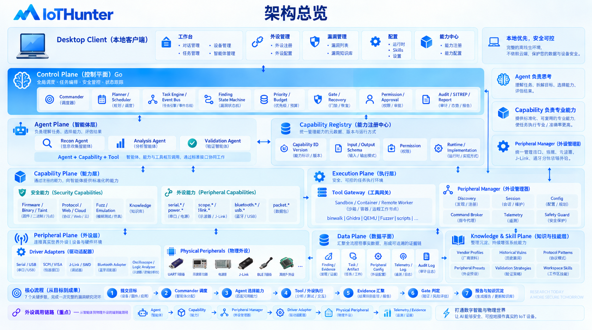

# IoTHunter

English | [中文](README.zh-CN.md)

IoTHunter is a capability-isolated, multi-agent research harness for IoT security work. It separates the control plane, agents, capabilities, and tool runtimes, with Finding and Evidence as the source of truth. The system supports recoverable tasks, least-privilege execution, human approval, audit logs, and report generation.

This repository contains a runnable core MVP. It does not require PostgreSQL, Redis, Docker, or an LLM service. The default store is a local JSON file, which makes the project easy to try, extend, and publish on GitHub. Production deployments can replace the store with PostgreSQL, add object storage, and run capabilities inside containers or remote workers.

## Design

The architecture document's minimum loop is runnable in this MVP:

~~~text
Target -> Task -> Agent -> Capability -> Tool/Worker -> Evidence -> Finding -> Report
~~~

The responsibilities are intentionally separated:

~~~text
Agent       understands, decides, and evaluates
Capability  exposes a reusable, testable specialist function
Tool        performs the concrete execution
Harness     controls scheduling, permissions, state, audit, and recovery
~~~

Core principles:

- Finding is the primary research fact; every conclusion should point to Evidence.
- Agents do not run arbitrary shell commands, edit the database, or operate devices directly.
- Capabilities declare input/output contracts and permissions.
- Finding and Task transitions are explicit state-machine operations.
- Device and destructive permissions enter an Approval queue and resume only after approval.
- Important actions produce Event and append-only Audit Log records.
- Model providers are not hard-coded and can be replaced later.

## Included

Go control plane:

- Workspace, Target, Task, Finding, Evidence, Artifact, Approval, Event, and Audit Log models.
- Atomic JSON-file persistence with in-process concurrency protection.
- Capability Registry and built-in capabilities: target.fingerprint, finding.gate, and report.generate.
- Scheduler/worker pool with configurable concurrency.
- Permission checks, approvals, blocked tasks, and approval-based recovery.
- Finding and Task state machines.
- REST API and command-line interface.
- A repeatable local demo.

Python worker:

- capability-workers/knowledge/worker.py is a dependency-free NDJSON worker example.
- One JSON request produces one JSON response, so the worker can run in a container or remote worker.
- The protocol can carry firmware, binary, protocol, fuzzing, emulation, and knowledge capabilities.

## Quick start

Requirements: Go 1.22 or newer. The example Python worker requires Python 3.10 or newer.

~~~bash
go test ./...
go run ./cmd/iothunter demo --data .iothunter/state.json
~~~

The demo creates a Workspace and an authorized example Target, runs passive reconnaissance, creates a Candidate Finding and Evidence, and writes a Markdown report under .iothunter/reports.

Start the API server:

~~~bash
go run ./cmd/iothunter serve --addr :8080 --data .iothunter/state.json
~~~

## Local UI client

The server and frontend are embedded in the same Go binary. No Node.js, frontend build, or second process is required. Build and launch the local desktop-style client with:

~~~bash
make build
./bin/iothunter desktop --addr 127.0.0.1:8080 --data .iothunter/state.json
~~~

The command starts the local control plane and opens `http://127.0.0.1:8080` in the default browser. The UI includes workspace and target intake, research runs, task and finding state, capability and tool registries, and report preview. On a headless machine, open the printed URL manually.

The console also exposes the architecture's control-plane objects: Agent pool, Skill workflows, Evidence and Artifact records, Approval queue, Event stream, Audit Log, CapabilityRun, ToolRun, GateDecision, and Knowledge items. Finding Gate actions and Task pause/resume/retry/cancel operations are available from the API and are reflected in the workspace view.

Check the service and registries:

~~~bash
curl http://127.0.0.1:8080/healthz
curl http://127.0.0.1:8080/api/v1/capabilities
curl http://127.0.0.1:8080/api/v1/tools
~~~

## Standalone client

The same binary can run as a server or as a remote CLI client:

~~~bash
make build
./bin/iothunter client --server http://127.0.0.1:8080 health
./bin/iothunter client --server http://127.0.0.1:8080 capabilities
./bin/iothunter client --server http://127.0.0.1:8080 workspaces
./bin/iothunter client --server http://127.0.0.1:8080 workspace-create --name router-research --owner alice
./bin/iothunter client --server http://127.0.0.1:8080 workspace --id W-xxxx
./bin/iothunter client --server http://127.0.0.1:8080 target-create --workspace W-xxxx --name lab-router --authorized
./bin/iothunter client --server http://127.0.0.1:8080 run --workspace W-xxxx --target T-xxxx
~~~

make build creates bin/iothunter for the current platform. make build-all creates Linux amd64/arm64, macOS amd64/arm64, and Windows amd64 binaries under dist.

## API examples

Create a Workspace:

~~~bash
curl -X POST http://127.0.0.1:8080/api/v1/workspaces \
  -H 'Content-Type: application/json' \
  -d '{"name":"router-research","owner":"alice","description":"authorized lab"}'
~~~

Create an authorized Target:

~~~bash
curl -X POST http://127.0.0.1:8080/api/v1/workspaces/W-xxxx/targets \
  -H 'Content-Type: application/json' \
  -d '{
    "name":"lab-router",
    "vendor":"ExampleVendor",
    "model":"Router X1",
    "address":"192.0.2.10",
    "transport":"http",
    "authorized":true
  }'
~~~

Submit a research run and inspect its result:

~~~bash
curl -X POST http://127.0.0.1:8080/api/v1/workspaces/W-xxxx/run \
  -H 'Content-Type: application/json' \
  -d '{"target_id":"T-xxxx"}'
curl http://127.0.0.1:8080/api/v1/workspaces/W-xxxx
curl http://127.0.0.1:8080/api/v1/tasks/TASK-xxxx
curl http://127.0.0.1:8080/api/v1/findings/F-xxxx
curl http://127.0.0.1:8080/api/v1/workspaces/W-xxxx/report
~~~

Approve a high-risk operation after reviewing it:

~~~bash
curl http://127.0.0.1:8080/api/v1/approvals
curl -X POST http://127.0.0.1:8080/api/v1/approvals/APR-xxxx \
  -H 'Content-Type: application/json' \
  -d '{"status":"approved","actor":"alice"}'
~~~

Commander planning and quality gates:

~~~bash
curl -X POST http://127.0.0.1:8080/api/v1/workspaces/W-xxxx/plan \
  -H 'Content-Type: application/json' \
  -d '{"target_id":"T-xxxx","objective":"offline analysis","capabilities":["target.fingerprint","web.route_discovery"]}'

curl -X POST http://127.0.0.1:8080/api/v1/findings/F-xxxx/gate \
  -H 'Content-Type: application/json' \
  -d '{"gate":"finding"}'
~~~

Registry and knowledge endpoints are available at `/api/v1/agents`, `/api/v1/skills`, `/api/v1/knowledge`, `/api/v1/events`, and `/api/v1/audit`. Capability workers can use the same structured request/result model to replace the built-in offline implementations.

## Storage and schemas

The default local layout is:

~~~text
.iothunter/
├── state.json
└── reports/
~~~

The state file is updated through a temporary file and rename. It is suitable for one local API process and tests. Use a database-backed Store for multiple API instances.

JSON Schemas are available at schemas/task.schema.json and schemas/finding.schema.json. The production workspace convention is documented in the architecture document and includes targets, findings, evidence, artifacts, tasks, capabilities, knowledge, skills, approvals, logs, and sitrep directories.

## Worker protocol

Workers use newline-delimited JSON and do not depend on a particular RPC framework. A request contains request_id, task_id, agent_id, capability_id, objective, inputs, permissions, and budget. A result contains status, summary, evidence, artifacts, confidence, metrics, and an optional error.

Run the example worker:

~~~bash
printf '%s\n' '{"request_id":"REQ-1","capability_id":"knowledge.search","inputs":{"query":"sprintf","corpus":["strcpy","sprintf"]}}' \
  | python3 capability-workers/knowledge/worker.py
~~~

A production Tool Gateway should validate schemas, intersect permissions from Agent/Task/Capability/Tool, select a sandbox or remote worker, enforce CPU/memory/disk/network/runtime limits, collect artifact hashes, and write Tool Run and Capability Run audit records.

## State machines

Finding lifecycle:

~~~text
Hypothesis -> Candidate -> Analyzing -> ReadyForValidation
                                      |
                              Validating -> Validated
                                      |
                              Reportable -> Reported -> KnowledgeCaptured
~~~

Insufficient analysis can return to Candidate. Failed validation can return to Analyzing or Candidate. Invalid transitions are rejected.

Task lifecycle:

~~~text
Queued -> Assigned -> Running -> Completed
                         |-> Failed -> Queued
                         |-> Blocked -> Queued
                         `-> Paused -> Running
~~~

## Security boundary

The MVP only registers passive, no-network, no-device, non-destructive capabilities. The example address 192.0.2.10 is reserved for documentation and is not a real target.

For real-device research, require all of the following:

~~~text
Target is authorized
AND Task permits device access
AND Capability permits device access
AND Tool permits device access
AND Device is available and locked
AND a human approved the high-risk action
~~~

The project does not determine your authorization scope. Run device validation, stress testing, flash writes, configuration changes, and persistent-impact PoCs only in an isolated lab with explicit authorization.

## Development

~~~bash
go test ./...
go test -race ./...
go vet ./...
gofmt -w cmd internal
make build
make build-all
~~~

To add a capability, define its input/output and PermissionSet, register a CapabilityExecutor or worker, validate every resource boundary, record Evidence and Artifact hashes, and add tests for success, denial, timeout, and malformed output. Route execution through Commander/Task instead of executing specialist tools inside HTTP handlers.

Model adapters, PostgreSQL, object storage, SSE/WebSocket, container sandboxes, distributed workers, and a Web UI are intentional extension points. The core API does not hard-code them.

## Roadmap

1. IoTHunter Core: real Agent Runtime, Model Adapter, and database repositories.
2. Capability Isolation: Tool Gateway, container/VM sandbox, and remote workers.
3. Validation: fuzzing, emulation, packet, and device capabilities with Approval Manager.
4. Knowledge and Skill: vendor profiles, vulnerability patterns, retrieval, and reusable workflows.
5. Platform: Web UI, streamed SITREP events, metrics, distributed scheduling, and Device Manager.

Production deployments should also add authentication, tenant isolation, secret management, object storage, rate limits, OpenTelemetry, Prometheus, migrations, backups, and retention policies.

## License and contributions

This project is released under the MIT License. See LICENSE. Issues and pull requests for new capabilities, workers, schemas, and research methods are welcome. Run go test ./... and go vet ./... before submitting changes.

For security reports, do not publish directly exploitable real-device details. Contact the maintainers privately with the affected version, reproduction prerequisites, and remediation advice.
